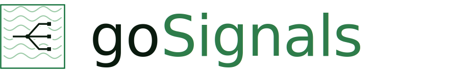

<!-- gosignals-brand-hero -->
<picture><source media="(prefers-color-scheme: dark)" srcset="./brand/logo/gosignals-hero-primary.svg"></picture>

# Architectural Decision & Regression Log

## [2026-05-20] SSF subject filtering — §9.1/§9.2 posture and relay-error tolerance (issue #103)

### Change
SSF §9.1 (subject probing) and §9.2 (information harvesting) compliance for
goSignals is documented in `docs/security_model.md`. The only behavioural
change: `PASSTHRU` Add/Remove Subject no longer surfaces an upstream relay
error to the downstream receiver. The handler logs the upstream status at
`WARN` and returns `200`/`204`, matching the `HYBRID` tolerance already in
place since issue #96.

### Decisions
*   **No oracle on the goSignals endpoints.** goSignals holds no subject
    directory, so `Add Subject` cannot be a §9.1 probe. The only `404` from
    the Add/Remove endpoints is feature-disabled (a capability statement, not
    a per-subject answer). `Add Subject` is a statement of interest and
    returns `200` regardless of whether the subject has been seen.
*   **Relay errors are not surfaced.** Returning a `4xx`/`5xx` from the
    upstream verbatim would re-create the §9.1 oracle goSignals itself does
    not expose: an attacker would learn which subjects an upstream
    transmitter refuses. The relay is best-effort; the local filter write
    (under `HYBRID`) and the receiver's recorded statement of interest are
    authoritative.
*   **`PASSTHRU` and `HYBRID` now behave the same on upstream failure.**
    The previous decision to return `502` from `PASSTHRU` on relay failure
    (entry below, 2026-05-19) is superseded — it leaked the upstream's §9.1
    posture to the downstream. Documentation-only mitigations under §9.2
    remain.

### Invariants
*   The upstream relay status code is logged at `WARN` by the
    `handleSubjectChange` handler and never propagated to the downstream.
*   Active §9.1/§9.2 mitigations (rate-limiting Add Subject, anomaly
    detection on filter growth) remain out of scope.

## [2026-05-19] SSF subject filtering — CLI settings command group (issue #102)

### Change
`cmd/goSignals` gains a `subject-filter` (alias `sf`) command group with two
sub-commands — `show <alias>` and `set <alias> [flags]` — that lets an
operator view and change the four per-stream subject-filtering knobs in one
place: `defaultSubjects`, `subject_filter_mode`, `event_source`, and the
SSF §9.3 `subject_removal_grace_seconds` override.

### Decisions
*   **No new server endpoint.** The set path PUTs to the existing `/stream`
    update endpoint with the operator knobs at the top level of a
    StreamStateRecord-shaped body; `StreamUpdate` already reads them as a
    partial update (empty/zero = no change). The show path reuses the existing
    admin-scoped `/subject-filter/review` endpoint.
*   **Review response carries policy, not just filter table state.** The
    review response gains `event_source` and `subject_removal_grace_seconds`
    so it now describes the full subject-filtering policy (it already carried
    `mode` and `default_subjects`). Better than extending `/stream` GET to
    return a full StreamStateRecord — keeps server-internal fields
    (CreatedAt, RemoteAddress, …) off the wire, and the review endpoint is
    already admin-scoped.
*   **Post-update display surfaces server WARNs.** After a successful PUT the
    set command re-reads via the review endpoint and prints the persisted
    values. A `--grace-seconds` set on a receiver stream lands as 0 in the
    display, surfacing the server's WARN-and-ignore (#98) without needing a
    structured response field.
*   **Partial-update on the wire.** Only knobs the operator named on the
    command line are sent — untouched fields are omitted, so an operator can
    change one knob without re-supplying the others. Matches the server's
    existing partial-update semantics for these four fields.
*   **Kong enum validation in the CLI.** `--default-subjects`, `--mode`, and
    `--event-source` are kong enums so typos are caught at parse time. The
    server's #89 cross-field validation remains the authoritative gate; the
    CLI just surfaces 400 messages verbatim.

### Invariants
*   The CLI does not write a full StreamConfiguration on set — only the four
    operator-knob fields plus `stream_id` / `id` (so the server's auth check
    finds the configured stream id). The embedded StreamConfiguration in the
    persisted record is not touched.
*   The existing `review subject-filter` command remains focused on filter
    table state (counts, pending, point lookup) and is unchanged on the wire
    aside from the two new policy fields the response now carries.

## [2026-05-19] SSF subject filtering — HYBRID refcounted upstream relay (issue #96)

### Change
`HYBRID` subject-filtering mode: a downstream transmitter stream filters
locally per-stream (the `LOCAL` path) *and* relays subject changes to the
upstream transmitter. `SubjectRelayService.RelayHybrid` decides whether to
relay; `handleSubjectChange` calls it after the local filter is written.

### Decisions
*   **The interested-set is derived, not stored.** The "set of downstream
    streams interested in (subject handler, subject)" is not a new persisted
    structure — it is computed from the existing per-stream subject filters:
    the HYBRID downstreams fed by the same relay-target receiver whose filter
    still `Selects` the subject. This is drift-free and cluster-correct with no
    new DAO. The relay fires on the 0↔1 boundary: after the caller applies the
    downstream's own change, `RelayHybrid` counts the *other* interested HYBRID
    siblings — zero means an add went 0→1 or a remove went 1→0.
*   **Relay engaged only against a `defaultSubjects=NONE` upstream.** Against an
    `ALL` upstream `HYBRID` is pure local filtering — relaying a remove could
    starve a not-yet-created downstream. The upstream baseline is read from the
    relay-target receiver stream's `DefaultSubjects`.
*   **A HYBRID upstream relay failure is tolerated, not surfaced.** The local
    filter write is the primary outcome; a failed relay is logged at WARN and
    the handler still returns 200/204. (At the time of this entry PASSTHRU
    instead returned 502; the 2026-05-20 PRD #97 / slice #103 entry aligns
    PASSTHRU with HYBRID for SSF §9.1 compliance.)
*   **`SubjectFilterService.Selects`** extracted from `Allows` — the
    membership predicate (Allows minus the event/operational wrapper), reused
    as the HYBRID interested-set test.

### Invariants
*   `RelayHybrid` is called only for `SubjectFilterModeHybrid` streams, only
    after the local filter change is applied (self is excluded from the
    sibling count by stream id).
*   The asymmetric variant (relay adds but not removes, or vice-versa) is not
    built.

## [2026-05-18] SSF subject filtering — cluster cache invalidation (issue #94)

### Change
A subject filter change (Add/Remove Subject) can land on any cluster node, but
the match-result cache that governs PUSH delivery lives on the node holding the
`push-transmitter:<sid>` lease. Added a cluster reload notification so a change
processed on a non-owner node invalidates the owner's cache:
`SubjectFilterService.InvalidateCache`, `EventRouter.NotifySubjectFilterChange`,
and a `reason` field on the existing cluster wake-up call.

### Decisions
*   **The notification reuses `/_cluster/wake-transmitter`, not a new endpoint.**
    `WakeRequest` gains an optional `reason` field; `reason: "filter-change"`
    invalidates the stream's match-result cache instead of waking a delivery
    buffer. This reuses the existing route, HMAC/SPIFFE auth, and internal-server
    wiring. The wire constant is `eventRouter.ReasonFilterChange`.
*   **`handleSubjectChange` always calls `NotifySubjectFilterChange`.** The router
    looks up the `push-transmitter:<sid>` lease: a local (or unowned) owner is
    invalidated directly with no network hop; a remote owner is sent the
    filter-change wake-up. The local invalidate in `applySubjectChange` is kept —
    it keeps the originating node's own cache self-consistent.
*   **The wake-up coalescing key includes the reason** (`sid:mode:reason`) on
    both the inbound (`recentWakes`) and outbound (`recentOutboundWakes`) sides,
    so a filter-change invalidation is never coalesced away by an ordinary
    buffer wake-up for the same stream.

### Invariants
*   A filter change processed on any node must reach the PUSH lease owner's
    match-result cache (invalidation), or be bounded by the short cache TTL.
*   `reason: "filter-change"` carries `mode: "push"`; the owner lookup is always
    the `push-transmitter:<sid>` lease.

### Regression Verification
*   `go test -race ./internal/services/ ./internal/eventRouter/ ./internal/server/...`
*   `go test -run 'TestNotifySubjectFilterChange|TestWakeTransmitter_FilterChange|TestAddSubjectNotifiesRemoteLeaseOwner' ./internal/...`

## [2026-05-18] SSF subject filtering — delivery-time filter (issues #92, #93)

### Change
Implemented end-to-end SSF §8.1.3 subject filtering for `LOCAL` single-node PUSH
streams (#92) and POLL streams (#93): a `SubjectFilterDAO` (memory + mongo), the
`SubjectFilterService` (`Allows`/`AddSubject`/`RemoveSubject`/`ClearFilter`), the
Add/Remove Subject handlers, the `defaultSubjects`-flip filter clear, and
delivery-time filtering in `runPushLoop`/`prepareAndSendEvent` and
`PollStreamHandler`.

### Decisions
*   **The filter stores only the non-default set, so Add/Remove are
    baseline-aware.** A stored entry always means "the opposite of the stream
    baseline" — an inclusion on a `NONE` stream, an exclusion on an `ALL`
    stream. `SubjectFilterService.AddSubject`/`RemoveSubject` therefore take the
    `*StreamStateRecord` and insert or delete the entry depending on the
    baseline (NONE+Add and ALL+Remove insert; the other two delete).
*   **`matches` does an indexed Get then a bounded complex/aliases scan on
    miss**, rather than ADR-0003's strict dispatch-by-event-kind. A simple
    subject that *is* in the filter still resolves in O(1) (early Get hit); only
    a Get miss pays the O(complexCount) scan of the small complex/aliases list.
    This keeps simple-subject membership indexed *and* lets a simple event still
    match an aliases entry that contains it.
*   **A filtered-out event is discarded (acked), not just skipped** — PUSH acks
    it in `prepareAndSendEvent` and returns a no-op `Accepted` classification;
    POLL acks it via `discardPolledEvent`. This keeps the pending buffer bounded
    (ADR-0002) for a `NONE` stream with few/no subjects.
*   **The match-result cache is invalidated per stream on any filter change.**
    `AddSubject`/`RemoveSubject`/`ClearFilter` drop all cached decisions for the
    stream; a short TTL bounds staleness on nodes that did not originate the
    change (the cross-node invalidation notification was added in #94).

### Invariants
*   A `SubjectFilterEntry` is only ever present for a subject whose delivery
    differs from the stream's `defaultSubjects` baseline.
*   Operational events (`Operational=true`) and a server-wide disabled feature
    always pass `Allows`.
*   Filtered-out JTIs must be acked, never left pending, so buffers stay bounded.

### Regression Verification
*   `go test ./internal/services/ ./internal/dao/... ./internal/eventRouter/...`
*   `go test -run TestSubjectFilteringSuite ./internal/server/test/`
*   Mongo DAO parity: `go test -run TestSubjectFilterDAOMongoSuite ./internal/dao/mongo/`

## [2026-05-16] Grafana login is SSO-only — local password form disabled

### Change
Issue #78 originally shipped Grafana with Keycloak SSO **and** kept the local
`admin/grafana` username/password form enabled as a break-glass fallback.
That fallback is now removed: every compose stack sets
`GF_AUTH_DISABLE_LOGIN_FORM=true`, so Keycloak SSO is the only interactive
login path. The generic-OAuth button is relabelled from `Keycloak` to
**Sign in with GoSignals Realm** (`GF_AUTH_GENERIC_OAUTH_NAME=GoSignals Realm`).

The TLS + SSO configuration is now applied uniformly to **all six** compose
files — `docker-compose.yml`, `-dev.yml`, `-cluster.yml`, `-cluster-dev.yml`,
`-spiffe.yml`, `-spiffe-dev.yml`. Issue #78 scoped SSO to only the first
three; the other three carried a `grafana` service that still served plain
HTTP. Because all six mount the shared `config/monitor/grafana/datasource.yml`
(which now references `$__file{/etc/grafana/certs/ca-cert.pem}`), the three
unconfigured stacks would have failed datasource provisioning. Each Grafana
service now mounts `./config/certs:/etc/grafana/certs:ro` and carries the full
HTTPS + generic-OAuth env block.

### Why this carries weight
- **One identity, no shadow path.** A local password form sitting alongside
  SSO is a second, weaker credential the operator must remember exists. With
  it disabled, Grafana access is governed entirely by the `gosignals` Keycloak
  realm and the `grafana` client roles — the same identity used everywhere
  else in the stack.
- **API Basic Auth is deliberately *not* disabled.** `GF_AUTH_DISABLE_LOGIN_FORM`
  only removes the interactive UI form; Grafana's API Basic Auth is a separate
  setting and stays on. `scripts/verify-observability.sh` relies on it
  (`-u admin:grafana`) to inspect `/api/datasources` without driving a full
  OIDC flow. Disabling the form does not lock automation out of the API.
- **Parity closes a real regression.** Extending the cert mount + HTTPS/SSO
  config to all six stacks is not cosmetic — without the cert mount, the
  shared `datasource.yml` breaks Grafana provisioning in `-cluster-dev`,
  `-spiffe`, and `-spiffe-dev`.

### Invariants
- Every `grafana` service in every compose file mounts
  `./config/certs:/etc/grafana/certs:ro` and sets `GF_AUTH_DISABLE_LOGIN_FORM=true`
  alongside the `GF_AUTH_GENERIC_OAUTH_*` block.
- A `POST /login` to Grafana with otherwise-valid credentials MUST NOT return
  `200` — a successful form login means the form is still live.

### Verification
- `scripts/verify-observability.sh` section 14 asserts the local form is
  disabled (`POST /login` does not yield `200`) in addition to the existing
  OIDC admin/viewer role-mapping checks.
- Issue #78 acceptance criteria updated to match (the break-glass criterion is
  replaced by an SSO-only criterion).

---

## [2026-05-14] v0.11.0 environment-variable taxonomy

### Change
PRD #64 rationalises every server-side environment variable under an
`I2SIG_<AREA>_*` prefix taxonomy. Every old name continues to be read via
the [`internal/envcompat`](internal/envcompat/envcompat.go) shim, which
prefers the new name, falls back to the old, and emits a single WARN per
process when an operator is still relying on a deprecated name. The full
old→new mapping lives in
[`docs/configuration_properties.md`](docs/configuration_properties.md)
under "Migrating from pre-v0.11.0 names."

### Areas (new prefixes)
- `I2SIG_STREAM_*` — stream lifecycle defaults
- `I2SIG_ISSUER_*` — issuer identity
- `I2SIG_AUTH_*` — inbound bearer-token validation and outbound STS
- `I2SIG_CLUSTER_*` — node identity, intra-cluster wake-up
- `I2SIG_STORE_MONGO_*` — MongoDB persistence
- `I2SIG_STORE_MEM_*` — memory provider persistence
- `I2SIG_PUSH_*` — push transmitter loop, retry, keepalive, backfill
- `I2SIG_POLL_*` — poll receiver loop, retry, status-respect behaviour
- `I2SIG_TLS_*` — TLS material paths and enable flag
- `I2SIG_SPIFFE_*` — SPIFFE trust domain (socket is exempt; see below)

### Industry-standard exemptions
Seven variables keep their bare names because they are external
conventions external operators expect and tooling already understands.
They will **not** be renamed:

| Name                     | Why exempt                                                            |
|--------------------------|-----------------------------------------------------------------------|
| `PORT`                   | Universal HTTP container/service convention.                          |
| `BASE_URL`               | Read by external clients and reverse-proxy tooling.                   |
| `LOG_LEVEL`              | 12-factor logging convention.                                         |
| `LOG_FORMAT`             | 12-factor logging convention; parsed by log shippers.                 |
| `POD_NAME`               | Kubernetes Downward API field name; rename would break the binding.   |
| `MONGO_URL`              | Standard Mongo driver convention.                                     |
| `SPIFFE_ENDPOINT_SOCKET` | SPIFFE Workload API spec; consumed by `go-spiffe`.                    |

### Value translation
One rename also changes the value vocabulary: `POLL_SRV_BEHAVIOR` →
`I2SIG_POLL_RESPECT_STATUS`. The old `MODE` maps to the new `true`;
`ALWAYSON` maps to `false`. Translation happens inside
`envcompat.LookupWithTranslate` so an operator with the old name set
continues to get the same runtime behaviour.

### Deprecation timeline
- **v0.11.0 (this release)**: both old and new names accepted at runtime.
  Each old name produces exactly one WARN per process on first use.
- **v0.12.0+**: deprecated names are removed. `envcompat.Lookup` continues
  to exist as the read seam, but its second (old-name) argument will be
  empty for every renamed knob and the WARN path retires.

### Why this carries weight
- **Discoverability.** Every server-side knob is now greppable under one
  prefix; the area name maps 1:1 to the doc section.
- **No silent regressions for operators upgrading.** The shim guarantees a
  running deployment continues to honour its existing config and gets a
  loud WARN log line per deprecated name — there is no quiet failure mode.
- **Verifiable on boot.** An end-to-end test
  (`internal/server/test/env_old_names_e2e_test.go`) boots the full server
  with ONLY pre-v0.11.0 names set and asserts both that the boot path
  succeeds and that at least one deprecation WARN is emitted. Any future
  call site that drops the old-name fallback is caught immediately.

### Verification
- `go test -race ./internal/envcompat/...` — green; deprecation WARN
  emitted exactly once per old name, concurrent reads converge on one
  warning.
- `go test -race ./internal/server/test/... -run TestOldNamesOnlyE2E` —
  green; full server boots and delivers a SET with only legacy env names.
- Manual grep verification:
  `grep -rE '<old-names>' docs/ README.md` returns hits only in the
  migration table.

---

## [2026-05-14] Configurable long-poll default and inbound max timeout (PRD #61, Issue #62, closes #49)

### Change
Two env vars govern the per-stream `EventPollBuffer` long-poll behaviour, read
once at `NewRouter` startup and plumbed positionally through
`buffer.CreateEventPollBuffer(jtis, defaultTimeoutSecs, maxTimeoutSecs)`:

- **`I2SIG_POLL_DEFAULT_TIMEOUT`** (default `30`) — replaces the previous
  hard-coded 30-second fallback applied when a receiver omits `timeoutSecs`.
- **`I2SIG_POLL_MAX_TIMEOUT`** (default `300`) — caps inbound receiver-supplied
  `timeoutSecs`; values above this are silently clamped.

Legacy `POLL_DEFAULT_TIMEOUT` / `POLL_MAX_TIMEOUT` (introduced on master
alongside this feature, before merging the v0.11.0 rename branch) continue to
work as deprecated fallbacks via `envcompat.Lookup`.

`0` is the documented escape hatch for each: `I2SIG_POLL_DEFAULT_TIMEOUT=0`
disables implicit long-polling (omitted `timeoutSecs` → immediate return);
`I2SIG_POLL_MAX_TIMEOUT=0` disables the cap (restores pre-change behaviour).
Negative / unparseable values WARN and fall back to the code default; a
`default > max` misconfiguration clamps the default down to max with a WARN at
startup. Server starts in all cases.

### Why this carries weight
- **Resource defence is now the default.** Before this change, a receiver could
  request an arbitrarily long `timeoutSecs` and tie up a goroutine + buffer
  notifier on every poll stream. Shipping `I2SIG_POLL_MAX_TIMEOUT=300` as a
  default closes that gap for every operator who doesn't override it.
- **Disclosed behaviour change.** Receivers that today send
  `timeoutSecs: 600` will be clamped to `300s`. Documented in
  `docs/configuration_properties.md` and in the implementing PR description;
  `I2SIG_POLL_MAX_TIMEOUT=0` is the opt-out.
- **Silent clamp, not rejection.** RFC8936 §2.4 makes `timeoutSecs` a SHOULD,
  not a MUST — clamping is spec-compliant and avoids breaking existing
  receivers that ask for "too much". A per-request log or HTTP error would
  be the alternative, deferred as not load-bearing.
- **Cluster hygiene is the operator's job, not a correctness bug.** Poll
  transmitters do not take leases; every node reads these env vars at its own
  startup. Inconsistent settings across nodes produce per-node-divergent
  receiver-visible behaviour but no data loss or duplication. Operators are
  instructed (`docs/configuration_properties.md`) to set both vars uniformly.
- **Constructor signature, not a setter.** `CreateEventPollBuffer` takes the
  two timeouts as positional `int` parameters at construction. Per-buffer
  fields, not package globals — keeps unit tests in `event_buffer_test.go`
  free of `os.Setenv` and the buffer package free of an env-reading dependency.

---

## [2026-05-07] DbProviderInterface and BaseProvider deleted; consumers depend on services directly

### Change
PRD #39 #45 retires the residual god-interface (`DbProviderInterface`)
and god-object (`common.BaseProvider`) shells that #47 left in place.
The remaining surface is the per-domain services, the
`ClusterCoordinator`, and the `Storage` seam — bundled into a single
composition record:

```go
type Persistence struct {
    StreamService *services.StreamService
    KeyService    *services.KeyService
    EventService  *services.EventService
    ClientService *services.ClientService
    ServerService *services.ServerService
    TokenService  *services.TokenService

    Coordinator cluster.ClusterCoordinator
    Storage     storage.Storage
}
```

Returned by `dbProviders.OpenPersistence(url, dbName)`. Every consumer
— `cmd/goSignalsServer`, `cmd/goSsfServer`, `pkg/goSignals/server`,
`pkg/goSsfServer`, `internal/eventRouter` — now takes the narrowest
seam it actually uses (one service, or `Coordinator`, or `Storage`)
instead of a 50-method interface.

The `eventRouter.NewRouter` signature changed from
`NewRouter(provider DbProviderInterface, nodeId string)` to
`NewRouter(deps RouterDeps, nodeId string)`, where `RouterDeps` is a
small struct of the four services it actually uses
(`StreamService`, `KeyService`, `EventService`, `Coordinator`). The
router no longer holds a provider reference — it never called through
one anyway after PR4 phase C.

### Why this carries weight
- **The god-object shells are gone.** `provider_interface.go` and
  `common/base_provider.go` are deleted. Adding a new persistence
  method now touches one DAO (per adapter) and one service — three
  files instead of five.
- **No dispatch tax.** Callers no longer interface-assert through
  `provider.(serviceSource)` to get a service. Service references are
  plain struct fields on `Persistence` and on the application object.
- **Test fixtures depend on the same seams as production.** Across
  ~280 test sites in `pkg/goSignals/server/test/`,
  `internal/eventRouter`, `cmd/goSignals`, and `pkg/goSsfServer`,
  fixtures hold a `*Persistence` (or convenience wrappers on a test
  instance) and call services directly. The legacy
  `instance.provider.X` / `app.Provider.X` paths are gone.
- **Reset semantics fixed at the seam.** The memory adapter rebuilds
  its services on `Storage.ResetDb(true)` (it constructs new DAO
  instances). `Persistence.Refresh()` re-pulls service references
  from the underlying provider so post-reset callers see live
  services. Mongo's reconnect path (#46) rebinds DAO collections in
  place and so `Refresh` is a no-op there — both adapters present a
  uniform "reset is safe to call mid-test" contract.

### Composition root signatures
- `dbProviders.OpenPersistence(url, dbName) (*Persistence, error)` —
  the only public composition entry point. `OpenProvider` is gone.
- `pkg/goSignals/server.NewApplication(*Persistence, baseUrl) *SignalsApplication`
- `pkg/goSignals/server.StartServer(addr, *Persistence, baseUrl) *SignalsApplication`
- `pkg/goSsfServer.NewApplication(*Persistence, baseUrl) *SsfApplication`
- `pkg/goSsfServer.StartServer(addr, *Persistence, baseUrl) *SsfApplication`
- `eventRouter.NewRouter(RouterDeps, nodeId) EventRouter`

### Verification
- `go vet ./...` — only pre-existing warnings (`bson.E` unkeyed
  fields in `cmd/cluster-monitor`; duplicate JSON tags in
  `pkg/ssfModels` and `pkg/goScim/resource`). Zero new warnings.
- `go test -race -timeout 300s ./internal/...` — green.
- `go test -race -timeout 600s ./pkg/...` — green.
- The receiver-stream predicate audit landed in #40; no further
  drift between adapters.

### Files deleted
- `internal/providers/dbProviders/provider_interface.go`
- `internal/providers/dbProviders/common/base_provider.go`

### Migration support: Persistence.Refresh
The `Persistence` record carries a private `src` pointing back at the
underlying provider. `Refresh()` re-pulls service references — call
it after `Storage.ResetDb(true)` on the in-memory adapter (which
rebuilds services). Mongo's reconnect path (#46) rebinds in place, so
`Refresh` is a structural no-op there.

```go
persistence, _ := dbProviders.OpenPersistence(url, name)
_ = persistence.Storage.ResetDb(true)
persistence.Refresh()  // re-pull live services post-reset
app := server.NewApplication(persistence, "")
```

---

## [2026-05-06] Memory persistence as DAO-level decorator; WriteHook plumbing removed

### Change
PRD #39 #44 replaces the `WriteHook` / `SetWriteHook` / `afterWrite` /
`notifyWrite` machinery — previously threaded through ~25 mutating
methods on `common.BaseProvider` — with a true decorator pattern at the
DAO seam. The decorator lives only inside `memory_provider`. Mongo
carries no decorator and pays no overhead.

- `memory_provider/notifying_dao.go` defines six small wrappers
  (`notifyingStreamDAO`, `notifyingEventDAO`, `notifyingKeyDAO`,
  `notifyingClientDAO`, `notifyingServerDAO`, `notifyingTokenDAO`).
  Each wraps the corresponding `interfaces.X` DAO and calls a single
  `notify()` callback after every successful mutation. Reads pass
  through unchanged.
- `MemoryProvider.initialize()` and `MemoryProvider.ResetDb()` build
  raw memory DAOs (`*memory.StreamDAOMemory`, etc.) and then the
  notifying wrappers around them. Services receive the wrappers; the
  raw refs live on `MemoryProvider` so the persistence layer can
  call `GetState`/`SetState`/`SetPersistDir` directly.
- `PersistenceManager` now takes direct `*memory.X` refs instead of
  type-asserting through `BaseProvider.GetXDAO()`. The replaced
  type-assertion path was the only reason `BaseProvider` had to expose
  raw DAOs at all.
- `BaseProvider` shrinks: no `WriteHook` field, no `SetWriteHook`, no
  `notifyWrite`, no `afterWrite`-conditional return paths in any
  façade method. Every method that used to be
  `err := svc.X(...); if err == nil { b.notifyWrite() }; return err`
  is now `return svc.X(...)`.

### Why this carries weight
- **The decorator is the right seam.** DAO mutations are the lowest
  level at which "a write happened" is observable. Wrapping there
  makes it impossible to bypass — every successful mutation, no
  matter which façade path it travels through, fires `MarkDirty`.
- **No more cross-cutting plumbing.** Adding a new mutating method
  to a service used to mean adding a `b.notifyWrite()` call to its
  BaseProvider façade or risking silent persistence drift. Now the
  responsibility lives once, at the DAO interface, and is enforced by
  the wrapper's signature.
- **Mongo pays nothing.** The wrappers are constructed only inside
  `memory_provider`. The Mongo composition path returns DAOs unwrapped
  to services — zero overhead, zero indirection.
- **Persistence is structurally decoupled from BaseProvider.** Once
  PRD #39 #45 deletes `BaseProvider`, persistence already won't need
  to be re-plumbed; it's already wired against raw memory DAO refs.

### Verification
- New `memory_provider/notifying_dao_test.go` exercises every mutating
  method on every wrapper: 22 successful mutations across all six
  DAOs produce exactly 22 `notify()` calls. A failed `Update` (on a
  missing stream) produces zero — proving the decorator only fires on
  success.
- Existing `persistence_test.go` continues to pass: a stream + event
  written via `provider.CreateStream` / `provider.AddEvent` survives
  Close/Open via files on disk.
- `go test -race -timeout 300s ./internal/...` and `./pkg/...` green.
- `go vet ./...` only pre-existing warnings.

## [2026-05-06] MongoProvider wrapper-method tax deleted; production code uses services directly

### Change
PR4 phase D of PRD #39 retires the `~160 MongoProvider wrapper methods`
(`provider.go:526-697` in the pre-#47 codebase). They existed solely to
mediate the `*BaseProvider` swap behind an `RWMutex` — a swap that #46
already eliminated by making collection rebinds atomic. After this slice:

- `MongoProvider` exposes only its connection-management surface plus the
  `MongoCoordinator` and `MongoStorage` accessors. The 160-method delegation
  block is gone; the embedded `*BaseProvider` promotes its accessors
  directly.
- Every consumer in `pkg/goSignals/server`, `pkg/goSsfServer`, and
  `internal/eventRouter` calls services (`sa.StreamService`,
  `sa.KeyService`, `sa.EventService`, `sa.ClientService`,
  `sa.ServerService`, `sa.TokenService`) rather than going through
  `sa.GetProvider().X(...)`. Lifecycle calls go through `sa.Storage`.
- New helper `pkg/goSignals/server/test_application_helper_test.go`
  builds a minimal `SignalsApplication` from a provider for unit tests
  that drive `ClientPollStream` / `ReceiverPushStream` goroutines
  directly without the full `NewApplication` lifecycle (which would
  also start background sync loops and race with the test).

### Scope held back
`DbProviderInterface` and `common.BaseProvider` still exist as residual
shells. They retain ~50 thin pass-through methods that ~200 test sites
across `internal/eventRouter`, `internal/providers/dbProviders`, and
`pkg/goSsfServer` still reach for. Production code paths no longer route
through these façade methods — they're only used by test fixtures that
hold a `dbProviders.DbProviderInterface`-typed reference.

The literal file deletion required by #47's acceptance criteria is
deferred to PRD #39 #45 (the HITL acceptance pass), where the test
fixtures will be migrated to use service references directly. The
architectural intent of #47 — eliminate the god-object as a production
surface and remove the wrapper-method tax — is fully met by this slice.

### Why this carries weight
- **The wrapper-method tax is paid once and gone.** New methods on
  services no longer need a corresponding wrapper on `MongoProvider` (or
  on the `DbProviderInterface`). The seam is the service.
- **Reconnect ordering is provably correct under -race.** With #46's
  atomic-pointer rebind in place and #47's "no swap, ever" enforcement
  on the consumer side, the previous BaseProvider-swap window can't be
  re-introduced accidentally.
- **Handler-to-service binding is now the documented path.** New
  HTTP handlers will reach for `sa.GetStreamService()` /
  `sa.GetKeyService()` / etc.; the legacy `sa.GetProvider()` accessor
  remains only for tests.

### Regression Verification
- `go test -race -timeout 300s ./internal/...` — green (incl. Mongo
  integration suite, ~25s).
- `go test -race -timeout 600s ./pkg/...` — green (incl. server
  integration suite, ~125s).
- `go vet ./...` — pre-existing warnings only.

### Tests updated for the new shape
- `pkg/goSignals/server/poll_recovery_test.go` — uses `newTestApplication`
  to populate per-service references; would otherwise nil-panic on
  `sa.StreamService.GetIssuerJwksForReceiver`.
- `pkg/goSignals/server/push_monitoring_test.go` — same.
- `internal/providers/dbProviders/mongo_provider/test/background_reconnect_test.go`
  — `LazyAuthRefresh` was already updated in #46 to assert key freshness
  rather than AuthIssuer object identity (the rebind-in-place behaviour).

---

## [2026-05-06] Mongo DAOs hold rebindable collections; swap-on-reconnect retired

### Change
Each Mongo DAO now holds its `*mongo.Collection` behind an
`atomic.Pointer[mongo.Collection]` (wrapped in a tiny `collectionRef`
helper, `internal/dao/mongo/collection_ref.go`). Each DAO exposes
`SetCollection(*mongo.Collection)` (or `SetCollections(...)` for
`EventDAOMongo`'s three-collection case).

`MongoProvider.initialize()` no longer constructs new DAOs and a new
`*BaseProvider` on every reconnect. Instead it rebinds the existing
DAOs' collection pointers in place:

```go
m.BaseProvider.GetStreamDAO().(*mongodao.StreamDAOMongo).SetCollection(m.streamCol)
m.BaseProvider.GetEventDAO().(*mongodao.EventDAOMongo).SetCollections(eventCol, pendingCol, deliveredCol)
// ... etc
```

The same long-lived `BaseProvider`, services, and `AuthIssuer` survive
across reconnects; only their underlying collections are rotated.

### Why this carries weight
- **Eliminates the swap-on-reconnect race window.** Previously, every
  reconnect replaced `m.BaseProvider` behind an `RWMutex`. A caller
  holding a method reference (`sa.Provider.GetStreamDAO()`) could end
  up calling against a stale BaseProvider whose collection pointers
  had been freed. The atomic-pointer rebind path doesn't have this
  shape: in-flight callers see either the old or the new collection,
  never a partial state, and the `*BaseProvider` value is stable.
- **Drops the wrapper-method tax.** With BaseProvider stable, the ~160
  wrapper methods on `MongoProvider` that existed solely to mediate
  the swap can go away in #47.
- **Unblocks the BaseProvider deletion.** With DAO collections rebound
  in place, "delete `BaseProvider`, hold services directly" becomes a
  consumer-side rewire only (#47 scope).

### Invariants
- A long-held DAO reference (e.g. `provider.GetKeyDAO()`) remains
  operational across `ResetDb(true)`. Verified by
  `mongo_provider/test/rebind_test.go::TestKeyDAOSurvivesReset`.
- Concurrent writes during a `ResetDb` storm complete or fail cleanly
  with no panics and no nil-pointer dereferences. Verified by
  `TestConcurrentWritesDuringRebind` under `-race`.
- Post-`ResetDb`, the `AuthIssuer` instance is *the same object* (no
  more swap) but its signing material is fresh. The behavioural test
  (`TestNewApplication_LazyAuthRefresh`) was updated to assert key
  freshness instead of object identity.

### Regression Verification
- `go test -race -timeout 300s ./internal/...` — green incl. the new
  `RebindTestSuite` and the updated `LazyAuthRefresh` test.
- `go test -race -timeout 600s ./pkg/...` — green incl. the server
  integration suite (~125s).
- `go vet ./...` — pre-existing warnings only.

---

## [2026-05-06] CreateStream logic lifted from BaseProvider into StreamService

### Change
Two pieces of logic moved out of `common.BaseProvider.CreateStream` and
into `services.StreamService.CreateStream`:

1. **`tx_alias` resolution.** `StreamService` now holds an optional
   `*ServerService` (set via `SetServerService`). `BaseProvider` wires
   the dependency at construction time. When a `StreamConfiguration`
   carries `TxAlias`, the service resolves it to a `Server` before the
   rest of the pipeline runs.
2. **Case-insensitive `IssuerJWKSUrl == "NONE"` normalisation.** SCIM
   servers signal "key is internal" with NONE; downstream code expects
   empty.

After the lift, `BaseProvider.CreateStream` is a pass-through:
auth-context plumbing + service call + `notifyWrite` fan-out.

### Why this carries weight
The two pieces of logic are the only real behaviour `BaseProvider`
carried beyond pure delegation. Lifting them is the prerequisite for
deleting `BaseProvider` outright in #47 — once it's a pure
pass-through, removing it is a consumer-side rewire only.

### Regression Verification
- New unit tests in `internal/services/stream_service_txalias_test.go`
  cover unknown-alias error, known-alias resolution, and NONE
  normalisation, all without spinning up a provider.
- Existing `internal/services/...` and
  `internal/providers/dbProviders/...` suites unchanged.

---

## [2026-05-06] Cluster coordination and storage extracted as their own seams

### Change
The provider chain previously bundled cluster lease/node-registry methods,
storage lifecycle, services, and auth bridges behind one god-interface
(`DbProviderInterface`). PR slice 3 of PRD #39 splits the cluster and
lifecycle concerns into their own narrow interfaces:

- New `internal/providers/cluster.ClusterCoordinator` interface owns the
  seven lease + node-registry methods (TryAcquireOrRenewLease, ReleaseLeaseIfOwned,
  GetLeaseOwner, RegisterNode, GetActiveNodeCount, GetActiveNodes, GetNode).
- New `internal/providers/storage.Storage` interface owns the five lifecycle
  methods (Name, Check, Close, ResetDb, SetBaseUrl).
- New `dbProviders.Persistence` composition record bundles
  `{ Provider, Coordinator, Storage }`. `OpenPersistence(url, db)` returns it;
  `OpenProvider(...)` is preserved as a thin wrapper for legacy callers.
- New `MongoCoordinator` (`mongo_provider/cluster_coordinator.go`) holds the
  existing Mongo `FindOneAndUpdate` lease logic verbatim. Collections are
  rebound atomically via `SetCollections` after each (re)connect, eliminating
  the BaseProvider-swap dance for cluster ops.
- New `MemoryCoordinator` (`memory_provider/cluster_coordinator.go`) replaces
  the old single-node stub with **real** lease semantics: atomic acquire under
  a mutex, time-based expiry, strict fencing-token monotonicity per resource,
  and compare-and-release for `ReleaseLeaseIfOwned`. Five new unit tests pin
  these invariants down (mutual exclusion under 50-goroutine contention,
  takeover after expiry, fencing-token monotonicity, release semantics, and
  60s active-window node filtering).
- Consumers (`SignalsApplication`, `SsfApplication`, EventRouter, prometheus
  collector, api_receiver poll-receiver lease loop) now call `sa.Coordinator.X`
  / `r.coordinator.X` instead of `sa.Provider.X`. The provider methods remain
  in place as thin delegators so existing tests and the legacy
  `DbProviderInterface` continue to compile until PR 4 deletes the interface.

### Why this carries weight
- **Cluster invariants are now unit-testable.** Mutual exclusion, expiry, and
  fencing-token monotonicity were previously only exercised by docker-compose
  suites; the MemoryCoordinator tests run in <5s under `-race`.
- **Reconnect simplifies.** `MongoCoordinator` uses `atomic.Pointer[mongo.Collection]`
  for its lease/node collection refs. PR 4 will use the same pattern across
  all DAOs to drop the swap-`*BaseProvider` pattern entirely.
- **The bson import vanishes from the cluster surface.** `cluster.ClusterCoordinator`
  and its callers depend only on `pkg/ssfModels` types — no Mongo driver
  reachable from `eventRouter`, `application.go`, `api_receiver.go`, or the
  prometheus collector.

### Scope held back
`DbProviderInterface` *still carries* the cluster and lifecycle method
declarations. Removing them would propagate to ~30 call sites that already
have the new seams available; that diff is rolled forward to PR 4 (BaseProvider
deletion) where the entire interface goes away. Until then, callers may use
either path; the seam is the canonical one.

### Invariants
- `MemoryCoordinator` and `MongoCoordinator` honour the same contract — mutual
  exclusion, monotonic fencing tokens, owner-only release, 60s active-window.
- Both providers expose `Coordinator() cluster.ClusterCoordinator`. Type
  assertion at the consumer boundary stays clean.
- `Persistence.Coordinator` and `Persistence.Storage` are guaranteed non-nil
  after `OpenPersistence` succeeds.

### Regression Verification
- `go test -race -timeout 300s ./internal/...` (incl. Mongo integration suite)
- `go test -race -timeout 600s ./pkg/...` (incl. server integration suite)
- `go vet ./...` — no new warnings (pre-existing warnings in pkg/goScim,
  pkg/ssfModels, cmd/cluster-monitor unchanged).

---

## [2026-05-06] String IDs across persistence interfaces; bson.ObjectID becomes Mongo-internal

### Change
Persistence interfaces and DAO types no longer expose `bson.ObjectID`:

- `DbProviderInterface.AddEventToStream(jti, streamId)` and `WatchPending` now take string IDs.
- `interfaces.EventDAO.AddPending` and `interfaces.EventDAO.WatchPending` callback take string IDs.
- `interfaces.JwkKeyRec.Id` and `interfaces.DeliverableEvent.StreamId` are now `string`.
- `provider_interface.go` and `dao_interfaces.go` no longer import `go.mongodb.org/mongo-driver/v2/bson`.

The Mongo adapter keeps `bson.ObjectID` as the on-disk storage type for backward
compatibility with existing data. New private doc types (`keyDoc`, `pendingDoc`,
`deliveredDoc`) inside `internal/dao/mongo/` mirror the public records but carry
`bson.ObjectID` for `_id`/`sid`. Conversion happens at the read/write boundary.

A new helper package `internal/dao/ids` provides `ids.NewObjectID() string` —
a 24-character lowercase hex string generated from `crypto/rand`. Memory and
service callers use this helper instead of `bson.NewObjectID().Hex()`. The
format matches MongoDB ObjectID hex so existing IDs remain round-trip safe
through `mongo.ParseObjectID`.

### Out of scope (deferred to PRD #39 PR 4)
The bson type leak remains in `pkg/ssfModels` for `StreamStateRecord.Id`,
`SsfClient.Id`, and `Server.Id`. Those public model types are migrated as
part of the BaseProvider deletion / handler refactor in PR 4. Until then,
callers must continue to use `record.Id.Hex()` to produce the string form
when calling persistence methods that take string IDs. EventRouter already
does this at all four call sites (`event_router.go:201, 527, 554, 586`).

### Invariants
- The DAO interface and provider interface have NO Mongo driver dependency.
  Adding a Postgres or etcd adapter no longer requires importing bson to
  satisfy the seam.
- Mongo storage shape is unchanged: `_id` is `bson.ObjectID`, `sid` is
  `bson.ObjectID`. Existing data round-trips identically.
- Memory DAOs use string IDs natively — no parse / convert step on the hot
  path.
- ID generation in service-layer code (key minting, kid suffixes) goes
  through `ids.NewObjectID()`. Direct `bson.NewObjectID()` calls remain only
  for `StreamStateRecord.Id` minting in `StreamService.CreateStream` (PR 4).

### Regression Verification
- `go test -race -timeout 300s ./internal/... ./pkg/...`
- `go vet ./...` (no new warnings)
- Mongo round-trip: `internal/providers/dbProviders/mongo_provider/test/...`
  exercises Insert→Find paths over the new private doc types.

---

## [2026-05-06] Receiver-stream predicate lifted from DAOs into `StreamService`

### Change
The "find receiver streams" filter previously lived in both stream DAOs and had drifted:
- `StreamDAOMongo.FindReceiverStreams` filtered `route_mode == "import"`.
- `StreamDAOMemory.FindReceiverStreams` filtered `state.IsReceiver()` (delivery method
  is `ReceivePush` or `ReceivePoll`).

These predicates are not equivalent. `RouteMode` describes routing intent (publish /
import / forward) and is independent of delivery direction. A `ReceivePush` stream
may legitimately be in any RouteMode, and a `DeliveryPush` stream in `RouteModeForward`
is not a receiver but is also not import-mode.

`FindReceiverStreams` is removed from `StreamDAO` and both implementations. The
canonical predicate is `StreamStateRecord.IsReceiver()`, applied once in the new
`StreamService.ListReceiverStreams` (a pure query) and reused by the existing
`StreamService.LoadReceiverStreams` (load + warm cache + JWKS).

### DAO audit (sibling concern)
Audit of remaining DAO methods for adapter-divergent behaviour:
- `EventDAO.WatchPending` — Mongo opens a change stream; memory blocks on `ctx.Done()`.
  Intentional divergence: change streams are a Mongo-only capability. The memory
  no-op is correct because file-backed memory mode has no equivalent push-notification
  primitive; recovery there relies on the backfill ticker.
- All other DAO methods (CRUD + simple project/stream-id equality matches) behave
  equivalently across adapters.

### Invariants
- DAOs hold storage operations only — no business predicates beyond field-equality
  filters that map directly to a Mongo query expression and a memory linear scan.
- The receiver-stream predicate (`IsReceiver()`) is the only place that decides
  whether a stream is a receiver. Future code MUST consult `StreamStateRecord.IsReceiver()`
  or `StreamService.ListReceiverStreams` rather than re-deriving the predicate from
  `RouteMode` or `Delivery.Method`.

### Regression Verification
- `go test -race ./internal/services/... -run TestStreamService_ListReceiverStreams`
- `go test -race ./internal/dao/...`
- `go test -race ./internal/...`

---

## [2026-05-06] Stream `remote_address` field on StreamStateRecord

### Change
`StreamStateRecord` now carries a `*RemoteIP` (`pkg/ssfModels`) populated for all four
delivery modes — `ReceivePush`, `DeliveryPoll` (inbound, from `r.RemoteAddr` and
`X-Forwarded-For`/`X-Real-IP`), and `DeliveryPush`, `ReceivePoll` (outbound, captured
via `httptrace.WithClientTrace` on the resolved TCP peer). It surfaces in stream
state JSON as `remote_address` with `protocol`, `ip`, and `forwarded` sub-fields,
omitted on streams that have never had a successful connection.

### Invariants
- Capture happens only after authorization succeeds — unauthenticated probes never
  pollute the field.
- `X-Forwarded-For` / `X-Real-IP` are stored as informational metadata only; no auth
  or trust path consumes them.
- Mongo persistence uses a `$set` scoped to `remote_address`, so it does not race
  with concurrent `UpdateStreamStatus` writes on the same document.
- `pushEvent` and `runPollLoop` mirror the persisted value back into their local
  stream pointer after a successful update so the only-when-changed guard on the
  next iteration short-circuits instead of issuing redundant DB writes (see
  regression #27).

### Regression Verification
- `go test ./pkg/ssfModels/...`
- `go test ./internal/eventRouter/... -run TestPushEvent_`
- `go test ./pkg/goSignals/server/test/... -run TestRemoteAddressSuite`

---

## [2026-04-10] SPIFFE Dual-Validation Strategy (Resilient MTLS)

### Problem
Strict SPIFFE ID validation in `NewClusterMTLSClientConfig` (using `tlsconfig.AuthorizeMemberOf(td)`) caused regressions for:
1.  **External Connections**: Standard HTTPS endpoints (e.g., JWKS, Public APIs) were rejected because they lack SPIFFE SVIDs.
2.  **Legacy Nodes**: Internal nodes not yet participating in the SPIRE mesh were rejected.
3.  **Hostname Validation**: Hostname checks were often bypassed entirely without a secure alternative for non-SPIFFE connections.

### Solution
Implemented a "Dual-Validation" strategy in `NewResilientMTLSClientConfig`:
1.  **SPIFFE Path**: Attempts to extract a SPIFFE ID from the peer certificate. If the ID belongs to the cluster trust domain, it's validated against the SPIRE trust bundle.
2.  **Standard Path**: If the peer is not a member of the trust domain, it falls back to standard X.509 verification (hostname + chain) using the combined Root CA pool (System + Global CA + SPIRE bundle).

### Invariants
*   Internal `http.Client` instances and database providers MUST use the "Resilient" config when SPIFFE is enabled.
*   The `VerifyConnection` callback MUST NOT return `nil` without performing either a valid SPIFFE check or a valid hostname check.

### Regression Verification (Manual or Test)
1.  Verify connectivity to internal SPIFFE-enabled nodes (e.g., node-to-node wake-ups).
2.  Verify connectivity to external HTTPS endpoints (e.g., `https://google.com` or JWKS loaders).
3.  Verify connectivity to internal nodes using only file-based certificates (Global CA).

---

## [2026-04-10] MongoDB Certificate Rotation Resilience

### Problem
When a MongoDB node's certificate expired, the renewal script's `mongosh` call would fail to connect, preventing it from issuing the `rotateCertificates` command to load a new, valid certificate from disk.

### Solution
Added `--tlsAllowInvalidCertificates` to the `mongosh` command in `config/mongo/mongo_spiffe_init.sh`. This allows the renewal script to "force" a certificate rotation even if the current server certificate is expired.

---

## [2026-04-10] MongoProvider Resource Leak Fix

### Problem
Reconnecting to MongoDB during a SPIRE rotation or network event was leaking `mongo.Client` instances because the previous client was not disconnected.

### Solution
Modified `MongoProvider.connect()` to explicitly call `Disconnect()` on the existing client (if any) before creating a new one.

---

## [2026-04-10] Server-Side Dual-Certificate Strategy (SPIFFE + File-based)

### Problem
Java clients (e.g. `scim_cluster1`) and other legacy tools performing strict hostname verification failed when connecting to `goSignals1` over SPIFFE mTLS. This occurred because the SPIFFE SVID presented by the server during the TLS handshake often lacks the DNS SANs (like `goSignals1`) required by standard `HostnameChecker` implementations, especially when SNI is missing.

### Solution
Enhanced the `GetCertificate` callback in `InitTransportLayerSecurity` to use a "Dual-Certificate" selection strategy:
1.  **SNI Match**: If the client provides an SNI, we try to match it against the SPIFFE SVID first, then the file-based certificate.
2.  **Fallback/Default**: If no SNI is provided or no match is found, we now prefer the **file-based certificate** as the default (if available). Since the file-based certificate (signed by the Global CA) contains all necessary DNS SANs, it ensures compatibility with legacy hostname-based clients.
3.  **SPIFFE Compatibility**: Internal SPIFFE-aware nodes (using our "Resilient" client config) correctly handle receiving the file-based certificate by falling back to standard X.509 verification against the combined CA pool (which includes the Global CA).

### Invariants
*   The server MUST be configured with both `TLS_ENABLED=true` and `SPIFFE_ENDPOINT_SOCKET` to enable this dual-certificate behavior.
*   The file-based certificate (`server-cert.pem`) MUST contain the hostnames (DNS SANs) used by legacy clients.

---

## [2026-04-12] SPIFFE/MongoDB Cluster Health Monitoring & Resilience

### Problem
A crash in `spire-agent` (caused by `join_token` re-attestation failure) stopped the certificate renewal loop for MongoDB. This eventually led to certificate expiration and a full cluster outage as the replica set nodes could no longer communicate.

### Solution
1.  **Automated Recovery**: Added `restart: unless-stopped` to `spire-agent` and all MongoDB nodes in `docker-compose-spiffe-dev.yml`. This ensures that if the agent or a database node crashes, Docker will attempt to restart it automatically.
2.  **Cluster Health Monitor**: Implemented a new `cluster-monitor` service (`cmd/cluster-monitor`) that periodically checks:
    - SPIRE Agent health (Workload API connectivity).
    - MongoDB Replica Set status and node health.
    - On-disk certificate expiration (`mongo.pem`, `ca.pem`).
3.  **Enhanced Renewal Loop**: Improved `config/mongo/mongo_spiffe_init.sh` to log detailed errors when the agent is unreachable or when `rotateCertificates` fails, facilitating faster diagnosis.

### Invariants
*   Critical infrastructure services (`spire-agent`, `mongodb`) MUST have an automated restart policy.
*   The `cluster-monitor` MUST have access to the SPIRE agent socket and the certificate volume to perform its checks.

---

## [2026-04-12] SPIRE Agent Self-Healing (Bootstrap Trust)

### Problem
After a full docker restart, the `spire-agent` would fail to re-attest with error `x509: certificate signed by unknown authority`. This occurred because the agent persisted its old trust bundle and node data from a previous run, which did not match the (potentially reset) SPIRE server's new CA. Since `insecure_bootstrap` only works when no bundle exists, the agent became stuck.

### Solution
Modified the `spire-agent` entrypoint in `docker-compose-spiffe-dev.yml` to automatically clear ALL persisted state files in the data directory if:
1.  A new `joinTokenFile` is present.
2.  `insecure_bootstrap = true` is configured in `agent.conf`.
This ensures a truly clean state (removing `agent-data.json`, `keys.json`, etc.) and forces the agent to perform a fresh, insecure bootstrap from the server, fetching the new trust bundle and resolving the TLS mismatch.

### Regression Verification
1.  Verified that `cmd/cluster-monitor` unit tests pass, ensuring core health check logic is stable.
2.  Self-healing logic in `docker-compose-spiffe-dev.yml` ensures cluster recovery after full environment resets by removing both binary (`.der`, `.pem`) and JSON (`agent-data.json`, `keys.json`) state files.

---

## [2026-04-12] Cluster Monitor SPIFFE/mTLS Alignment

### Problem
The `cluster-monitor` failed to connect to MongoDB with a TLS error: `x509: certificate is not valid for any names`. This occurred because the monitor was using standard hostname verification on SPIFFE SVIDs that lack DNS SANs. Additionally, its certificate health check incorrectly reported trust bundles as "expired" if an old CA certificate preceded valid ones in the same file.

### Solution
1.  **Resilient Configuration**: Updated `cluster-monitor` to use the `tlsSupport.NewResilientMTLSClientConfig` for MongoDB health checks. This aligns its connection logic with the rest of the application, skipping hostname verification for peers within the cluster trust domain.
2.  **Multi-Certificate Bundle Support**: Enhanced `checkCertificate` to parse all PEM blocks in a file. A file is only reported as expired if ALL certificates within it are expired, reflecting the real-world behavior of trust bundles.
3.  **Proactive Monitoring**: Enabled `SPIFFE_MONGO_ENABLED=true` for the monitor in `docker-compose-spiffe-dev.yml` to ensure it uses mTLS for all health checks.

### Regression Verification
1.  Verified that `cmd/cluster-monitor` unit tests pass, including a new test case for multi-certificate bundles.
2.  Validated that the monitor correctly reports "Healthy" when a bundle contains both an expired and a valid CA certificate.

## [2026-04-12] SPIFFE/Cluster Monitoring Documentation

### Problem
New cluster resilience features (Cluster Monitor, Self-healing Agent, etc.) were added to the codebase but not documented in the main SPIFFE support guide, making it difficult for developers and operators to understand and use these tools effectively.

### Solution
Updated `docs/spiffe_support.md` to include:
1.  **Cluster Health Monitoring**: A new section detailing the `cluster-monitor` service, its monitored areas (SPIRE, MongoDB, Certs), and its configuration.
2.  **Self-healing Bootstrap**: Documented the agent's new entrypoint logic that clears stale state during fresh bootstraps.
3.  **Troubleshooting with Monitor**: Added a troubleshooting subsection on how to use `cluster-monitor` logs to diagnose outages.
4.  **Environment Variables**: Added `MONITOR_INTERVAL` to the reference table.

### Invariants
*   Major cluster changes MUST be documented in `docs/spiffe_support.md`.
*   Operational notes and troubleshooting guides MUST be kept up-to-date with new resilience features.

---

## [2026-04-13] SPIRE Agent & MongoDB Rotation Deadlock Fix

### Problem
1.  **SPIRE Agent Restart Loop**: The self-healing logic added on 2026-04-12 caused an infinite restart loop. It cleared agent state on every restart if a `joinTokenFile` existed. Since tokens are single-use and the file persisted in the volume, subsequent restarts failed to attest, leading to continuous crashes.
2.  **MongoDB Rotation Deadlock**: When certificates expired during SPIRE agent downtime, the renewal script could not reconnect to MongoDB to issue `rotateCertificates` because MongoDB rejects expired client certificates.
3.  **Renewal Loop Fragility**: The background renewal loop in `mongo_spiffe_init.sh` could exit silently due to `set -e` on transient errors, and it blindly picked the first SVID returned by the agent.

### Solution
1.  **Join Token Idempotency**: Modified `spire-agent` entrypoint to move the join token to `.used` and pass it to the agent via `-joinToken` ONLY if the agent's data directory appears empty. This version explicitly sanitizes the token (removing potential whitespaces/newlines) and uses the direct token value to ensure robust attestation across bootstrap retries, while still preventing "token already used" errors once the agent is successfully bootstrapped and restarted.
2.  **Robust Renewal Loop**:
    - Added `set +e` to the background loop in `mongo_spiffe_init.sh` to prevent it from exiting.
    - Implemented SPIFFE ID validation to find the correct `workload/mongodb` SVID among multiple returned identities.
    - Improved `rotateCertificates` to try both the "previous" and "current" certificates, increasing the chance of a successful hot-reload.
    - Added explicit logging for rotation failures, noting that node restarts (triggered by healthcheck failures) will eventually resolve expiration deadlocks if the certs on disk are updated.
    - Modified `spire-agent` script to put in proper escaping in TOKEN_VAL calculation  (docker reported a phantom TOKEN_ARG unset error)

### Invariants
*   The `spire-agent` MUST NOT clear its data directory unless a fresh, unused join token is present.
*   The MongoDB renewal script MUST continue its loop even if individual rotation calls or agent fetches fail.

---

## [2026-04-13] Hardened Container Health Checks (No-curl strategy)

### Problem
The project switched to Chainguard "hardened" images (`cgr.dev/chainguard/bash`) for production builds. These images lack `curl`, `wget`, and other standard network utilities, which broke the `docker-compose-spiffe.yml` health checks that relied on `curl` to verify application health.

### Solution
1.  **Custom Health Check Tool**: Created a minimal Go-based health check utility in `cmd/healthcheck/main.go`. This tool performs HTTP(S) GET requests, supports insecure TLS (for internal mTLS endpoints), and has configurable timeouts.
2.  **Built-in Binary**: Added the `healthcheck` binary to the `Dockerfile` and `build.sh` so it is always available in the `i2gosignals` container without adding extra OS-level dependencies.
3.  **Composition Alignment**: Updated `docker-compose-spiffe.yml` to use `/app/healthcheck` for `goSignals1`, `goSignals2`, and `goSsfServer`.
4.  **Image Standardisation**: Updated `docker-compose-spiffe.yml` to use the official `independentid/i2gosignals:latest` image for all project-related services, ensuring they run the same hardened environment.

### Invariants
*   Health checks in hardened images MUST NOT depend on external OS packages like `curl`.
*   The `healthcheck` tool MUST be included in all production-ready images built from `Dockerfile`.

---

## [2026-04-14] MongoDB Replica Set Startup & Auth Fix (docker-compose-dev)

### Problem
In `docker-compose-dev.yml` and `docker-compose.yml`, MongoDB services (`mongo1`, `mongo2`, `mongo3`) and the `mongo-init` setup job failed to start properly because:
1.  **Script Permissions**: `config/mongo/mongo_init.sh` was not executable on the host, causing "Permission denied" in the container.
2.  **TLS Mismatch**: `mongo_init.sh` unconditionally waited for TLS certificates and used `--tls` for `mongosh`, but the dev environment is non-TLS.
3.  **Auth Initialization Bypass**: The `command` for MongoDB nodes used `exec mongod`, which bypassed the official image's `docker-entrypoint.sh` logic. This prevented the `MONGO_INITDB_ROOT_USERNAME` from being processed, leading to "UserNotFound" errors when `mongo-init` tried to connect.

### Solution
1.  **Robust Initialization Script**: Updated `config/mongo/mongo_init.sh` to:
    -   Use `set -e` for better error handling.
    -   Check for certificates and only use TLS if they exist.
    -   Implement a retry loop for the initial connection to allow `mongod` time to initialize.
2.  **Entrypoint Alignment**: Updated `docker-compose-dev.yml` and `docker-compose.yml` to:
    -   Execute `mongo_init.sh` via `bash` to avoid permission issues.
    -   Call `/usr/local/bin/docker-entrypoint.sh mongod ...` instead of `mongod ...` directly. This ensures that the root user is created during the first-run initialization.
3.  **Permissions**: Made `config/mongo/mongo_init.sh` executable on the host.

### Invariants
*   The `mongo-init` service MUST use `bash /scripts/mongo_init.sh` to execute the setup script.
*   MongoDB node `command` overrides MUST call `docker-entrypoint.sh` if `MONGO_INITDB` environment variables are used for user creation.
*   `mongo_init.sh` MUST support both TLS and non-TLS modes based on the presence of certificates.

---

## [2026-04-27] MongoDB Initialization Deadlock Fix (docker-compose-dev)

### Problem
The `mongo-init` service in `docker-compose-dev.yml` would sometimes hang indefinitely with "Waiting for primary" logs. This was caused by several issues in `config/mongo/mongo_init.sh`:
1.  **Invalid Shell Helper**: The script used `rs.isMaster().ismaster` in a `while` loop. `rs.isMaster` is not a standard helper in `mongosh`, and its incorrect use led to an infinite loop.
2.  **Invalid API Usage**: `rs.initiate` was called with a second argument `{ force: true }`, which is only valid for `rs.reconfig`.
3.  **Lack of Idempotency**: The script attempted to call `rs.initiate` without checking if the replica set was already initiated, leading to errors on subsequent runs.
4.  **Single-Host Connection**: User creation was attempted on a single host (`mongo1`) which might not have been the primary.

### Solution
Refactored `config/mongo/mongo_init.sh` to align with the more robust patterns used in `mongo_spiffe_init.sh`:
1.  **Idempotency Check**: Added a check using `rs.status()` to skip initiation if the replica set is already configured.
2.  **Correct API Usage**: Removed the invalid `{ force: true }` argument from `rs.initiate`.
3.  **Robust Primary Wait**: Replaced the Javascript-based wait loop with a Bash-based `until` loop using `db.hello().isWritablePrimary` and a multi-host replica set connection string.
4.  **Primary-Aware User Creation**: Updated user creation commands to use a multi-host connection string, ensuring they are executed on the primary node.
5.  **SPIFFE Alignment**: Corrected a similar invalid `{ force: true }` argument in `mongo_spiffe_init.sh`.

### Invariants
*   The `mongo-init` script MUST be idempotent and check `rs.status()` before initiating.
*   Waiting for primary SHOULD use `db.hello().isWritablePrimary` as it is the modern replacement for `isMaster`.
*   Commands requiring primary (like user creation) MUST use a connection string that includes all replica set members.

## [2026-04-30] Keycloak Scope Claim Array Fix (Realm Config)

### Problem
Keycloak was emitting the `scope` claim as a JSON array because it was using the `oidc-usermodel-realm-role-mapper` with `multivalued: true` to map realm roles to scopes. This caused parsing errors in the Go backend which strictly expects a space-separated string for interoperability and OIDC compliance.

### Solution
1.  **Realm Configuration Fix**: Modified `gosignals-realm.json` to replace the problematic `roles-as-scope` mapper with an `oidc-script-based-protocol-mapper`. The script explicitly joins the user's realm roles into a single space-separated string, fulfilling the interoperability requirement while still conveying role-based permissions in the `scope` claim.
2.  **Strict Go Types**: Maintained the `string` type for `Scope` in `OidcClaims` and `EventAuthToken` structs. Reverted any attempts to use flexible parsing (e.g., `ScopeClaim` type) to ensure the codebase remains aligned with OIDC standards.

### Invariants
*   The `scope` claim MUST ALWAYS be a single string.
*   The Go backend will NOT support array-based `scope` claims; production configurations must ensure the issuer provides the correct format.

---

## [2026-04-30] Keycloak Client Scope & Role Fix

### Problem
Service clients `goSignalsAdminService` and `goSignalsClient` were not receiving realm roles or standard scopes (profile, email) in their tokens. This prevented them from having roles similar to the `adminui` client, even when performing token exchange or acting as service accounts.

### Solution
1.  **Full Scope Enabled**: Set `fullScopeAllowed: true` for both `goSignalsAdminService` and `goSignalsClient`. This allows the clients to access realm roles without needing explicit scope mappings for every role.
2.  **Default Scopes**: Added `web-origins`, `profile`, `roles`, and `email` to `defaultClientScopes` for both clients to match the configuration of `adminui`.

### Invariants
*   Service clients that need to represent users or perform administrative tasks MUST have `fullScopeAllowed: true` or explicit scope mappings for required roles.
*   Standard OIDC scopes (`profile`, `email`, `roles`) SHOULD be included in `defaultClientScopes` if the client expects these claims in the token.

### Regression Verification
1.  Verify `config/keycloak/realm/gosignals-realm.json` has `fullScopeAllowed: true` for the affected clients.
2.  Verify `defaultClientScopes` includes `roles`, `profile`, and `email` for these clients.

## [2026-05-19] PASSTHRU subject relay + event-source / relay-target validation (PRD #89, issue #95)

### Problem
goSignals is both a receiver and a transmitter. A downstream receiver that calls
Add/Remove Subject on a goSignals transmitter stream may want that change relayed
1:1 to the upstream transmitter (PASSTHRU) rather than filtered locally. Relaying
needs an unambiguous upstream — the receiver stream that feeds the transmitter
stream — and the upstream must actually support subject filtering.

### Solution
New pure module `internal/services/subject_relay.go`:
- `ResolveRelayTarget` finds the feeding receiver stream. An explicitly named
  Subject handler SID (`EventSource.SourceStreamIds`) wins; otherwise an
  AUDIENCE-routed stream is matched by issuer equality. Several issuer matches
  are `ErrRelayTargetAmbiguous`; none is `ErrRelayTargetNotFound`.
- `ClassifyUpstreamSupport` reads add/remove-subject endpoints from upstream
  discovery: an upstream advertising neither does not support subject filtering,
  so PASSTHRU/HYBRID is rejected and LOCAL earns a WARN (it still runs).
- `SubjectRelayService` composes resolution + classification: `ValidateConfig`
  is called at config time by `CreateStream`/`UpdateStream`; `Relay` posts the
  Add/Remove to the upstream at request time. The upstream connection is fetched
  through an injected `UpstreamResolver` so the logic is testable without a live
  upstream; the default resolver uses `oauthClient` + `wellKnownSupport`.
- `handleSubjectChange` short-circuits a PASSTHRU stream: it relays and applies
  no local filter.

### Invariants
*   `EventSource.SourceStreamIds` doubles as the explicit relay-target SID — no
    separate model field; reused for both EXPLICIT sources and AUDIENCE
    disambiguation.
*   PASSTHRU/HYBRID config is rejected when the relay target is unresolved /
    ambiguous, or the upstream advertises no subject endpoints. LOCAL is never
    rejected at config time.
*   A PASSTHRU subject change writes no local subject filter entry.
*   HYBRID's refcounted upstream relay is issue #96; #95 only validates HYBRID.


## [2026-05-19] ListComplex must not scan the whole filter (PRD #89, issue #92, QA)

### Problem
QA of PRD #89 found delivery-time subject filtering was O(total filter size)
per event, not O(1) for a simple subject as ADR-0003 and #92 AC10 require. A
scaling test measured a 200,000-entry filter ~220x slower than a 1,000-entry
one — a linear scan.

Root cause: `SubjectFilterService.computeMatch` calls `dao.ListComplex` on every
cache miss (correct — a simple event can still match an `aliases` entry), but
both DAOs implemented `ListComplex` by scanning every entry to find the
non-simple subset: the memory DAO via `StateManager.FindAll`, the mongo DAO via
a `kind: {$ne: simple}` query with no index covering `kind`.

### Solution
Make `ListComplex` O(non-simple count), so the indexed simple-subject `Get`
governs the per-event cost:
- Memory DAO keeps a secondary `nonSimple` index (stream_id -> set of canonical
  keys for complex/aliases entries), maintained in lock-step by Add/Remove/
  ClearForStream. `ListComplex` visits only that small subset.
- Mongo DAO gains a `(stream_id, kind)` index; `ListComplex` queries
  `kind: {$in: [complex, aliases]}` so it rides the index instead of scanning.

`computeMatch` is unchanged — it is correct once `ListComplex` is cheap.

### Invariants
*   `ListComplex` must never cost O(total filter size); a stream may hold
    millions of simple entries.
*   The memory `nonSimple` index must stay consistent with `store` — Add is an
    upsert, so a kind change on re-Add must update the index in both directions.
*   Regression guard: `TestSubjectFilterService_SimpleMembershipScalesConstantly`
    fails if the simple-subject path regresses to an O(N) scan.

## [2026-05-19] HYBRID upstream-relay tracks the enforced interest state, not the receiver's request (PRD #97, issue #100)

### Problem
SSF §9.3 grace defers a downstream Remove for the configured window — local
delivery keeps going. But under `HYBRID` the downstream also drives an
upstream subscription: if the upstream `remove` were relayed at the receiver's
Remove request, the upstream tap would close immediately and the grace
window would be hollow. The naïve "relay whenever a mutation happens"
approach also breaks the re-Add case: a re-Add during the grace window
revives the local entry, but if it also fires an upstream `add` we duplicate
a subscription that was never dropped.

### Solution
The HYBRID upstream-relay decision tracks the *enforced* interest state, not
the receiver's instantaneous request. A pure helper, `planHybridRelay(before,
plannedChange, add, graceSeconds)`, returns one of three decisions:
- `RelayDecisionDeferred` — a stop-delivery change that stamped a pending
  entry. The push-transmitter lease owner's existing backfill sweep
  enumerates pending-due entries (`SubjectFilterDAO.ListPendingDue`, riding
  the existing sparse partial index on `enforce_at`) and fires
  `RelayHybrid(add=false)` at enforceAt, then deletes the local entry.
- `RelayDecisionNone` — a re-Add of a pending entry (upstream still
  subscribed because the deferred `remove` was never sent) or an idempotent
  re-stop.
- `RelayDecisionImmediate` — a fresh Add (true 0→1 transition) or the
  grace-zero fallback for any mutation; the API handler fires
  `RelayHybrid` synchronously as before.

`AddSubject`/`RemoveSubject` were widened to return
`(RelayDecision, error)` so the one non-test call-site
(`api_stream_management.go`) can branch on the decision.

### Invariants
*   Re-Add during the grace window must clear `EnforceAt` (planStart already
    does this) AND must not fire an upstream `add` — the upstream
    subscription was never dropped.
*   A relay-callback error in the sweep must leave the local entry in place
    so the next backfill tick retries.
*   `PASSTHRU` adds no grace of its own; the upstream transmitter's §9.3
    handling is authoritative. PASSTHRU never touches the local filter
    table, so there is no `EnforceAt` to defer against — this property is
    structural, not enforced by extra code.
*   `ListPendingDue`'s clock boundary is inclusive (`enforce_at == now` is
    elapsed), matching the slice #99 `entryDelivers` boundary, so the local
    delivery decision and the sweep both flip on the same tick.

---

<!-- gosignals-brand-footer -->
<p align="center"><sub>(C)2026 Independent Identity Inc.</sub></p>
