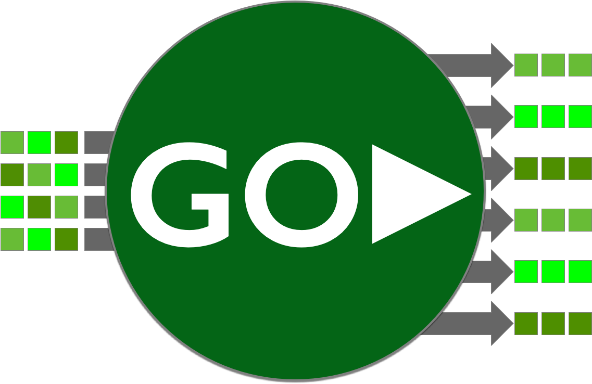

# i2goSignals

<div style="text-align: right"></div>

**_i2goSignals_** is a security signals processor implementing the OpenID [Shared Signals Events Framework](https://openid.net/specs/openid-sharedsignals-framework-1_0-02.html) as well 
as the SET [Security Event Token specification RFC8417](https://www.rfc-editor.org/rfc/rfc8417) and SET Event transfer protocols (RFC8935 and RFC8936). A SET Event token is a 
specialized type of Json Web Token traditionally used in [OAuth2](https://www.rfc-editor.org/rfc/rfc6749)
based authentication and authorization systems. SET tokens are used to convey security event signals between publishers and
receivers. The i2goSignals server works as a gateway router intended connecting one or more security 
event generators to one or more receivers across domains using streams. An i2goSignals server is able to receive, validate, route, and 
forward Security Event Tokens (SETs) in streams to registered receivers. 

The protocols used to transfer SET Event Tokens between parties are:
* [RFC8935](https://www.rfc-editor.org/rfc/rfc8935) - Push-Based Security Event Token (SET) Delivery Using HTTP, and
* [RFC8936](https://www.rfc-editor.org/rfc/rfc8936) - Poll-Based Security Event Token (SET) Delivery Using HTTP.

In practice, series of events are organized into "streams" where by each individual SET is acknowledged by receivers in order to guarantee lossless 
transfer and optional recovery of information.  Standard JOSE signing and encryption is used to validate and authenticate messages and optionally
the receiver of events.

The i2goSignals server has the following capabilities:
* Implementation of both SET PUSH (RFC8935) and SET POLL (RFC8936) Protocols
* Supports logical relationships between publishers and receivers in the form of "streams" (as defined in RFC8935/8936). For example, i2goSignals can take a single stream from a security event generator and distribute them to more than one outbound streams.
* Support for multiple inbound and outbound streams
* The ability act as protocol converter such as enabling Receivers that support Poll transfer only (e.g. from behind a firewall) to pick up events from SET Push-only transmitters.
* Support for fault-tolerant stream recovery including automatic re-transmission and stream resets
* Routing controls how received events are forwarded, and/or re-published to one or more outbound streams
* Each stream defines the issuer, audience and event types available and configured to be transmitted

The i2goSignals project is currently under development and is published for feedback and community involvement at this time.  This 
preview code is not yet ready for production. Key features such as administration API security, multi-node co-ordination and TLS are still in progress.

There are 3 main components to this project
* goSet - utility functions to create SET tokens (which are a profile of JWT tokens) and a set of convenience methods to add, validate, and parse events. Includes support for SCIM Events.
* cmd/goSignalsServer - provides a services framework to implement push and pull delivery services. This framework depends on MongoDB to store configuration and key data. SSEF also uses Kafka to pick up and store event streams per registered stream.
* cmd/goSignalsTool - A command line tool which can be used to configure and administrator an goSignals server.

## Getting Started

Clone or download the codebase from GitHub to your local machine and install the following prerequisites.

* [Go 1.19](https://go.dev)
* [Docker Desktop](https://www.docker.com/products/docker-desktop)

```bash
cd /home/user/workspace/
git clone git@github.com:i2-open/i2gosignals.git
```
To run the demonstration configuration, see Demonstration Set Up below.


Building a local docker image (starting from the main project directory):
```bash
go install ./...
docker build . --tag i2gosignals
```
> [!NOTE] 
> The 0.7.0 release image is also available at ghcr.io/i2-open/i2gosignals:0.7.0

This project uses MongoDB for event, key, and stream storage, management, and recovery. By default, unit testing is done with the MongoDb server defined in [docker-compose.yml](docker-compose.yml).

The use of Mongo can be changed out to other database systems. However at this time, it would depend on contributors to implement or sponsor such support.

Run the i2goSignals server and Mongo database using docker-compose

## Documentation
* [goSignals administration tool](docs/gosignals_tool.md)
* [Supported environment properties](docs/configuration_properties.md)


## Demonstration Set Up
in the file [docker-compose.yml](docker-compose.yml) is a sample set up that demonstrates both Push and Pull stream scenarios between 2 separate i2goSignals
servers. Additionally, 2 i2scim.io servers are used to demonstrate multi-master replication using SCIM defined provisioning events.

To configure the demonstration do the following:
1. Build the goSignals project (see above)
2. In /ect/hosts or your localdns configuration, define goSignals1 and goSignals2 to point to the corresponding goSignals server in docker (e.g. 127.0.0.1).
3. Start all servocers in `docker-compose.yml`
4. Start the `goSignals` tool and perform the following configuration
```bash
To be completed.
```