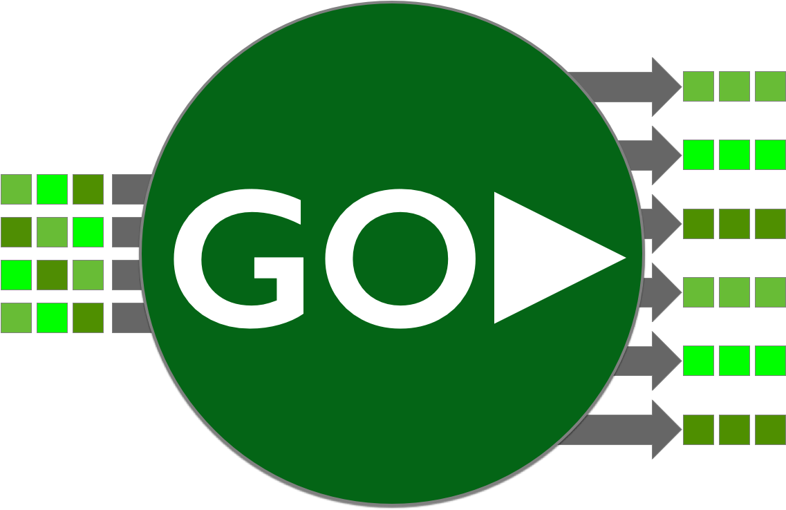

# i2goSignals

<div style="text-align: right"></div>

**_i2goSignals_** is a high-performance security event router and processor designed to facilitate the secure exchange of Security Event Tokens (SETs) between systems. It acts as a bridge, gateway, or store-and-forward server, connecting security event generators (transmitters) to receivers across different domains.

### Key Concepts
- **Security Event Token ([RFC8417](https://www.rfc-editor.org/rfc/rfc8417))**: A specialized JSON Web Token (JWT) used to describe security-related events.
- **Shared Signals Framework ([SSF](https://openid.net/specs/openid-sharedsignals-framework-1_0-final.txt))**: The framework defining how these event streams are managed and shared.
- **Delivery Protocols**: Support for both Push ([RFC8935](https://www.rfc-editor.org/rfc/rfc8935)) and Poll ([RFC8936](https://www.rfc-editor.org/rfc/rfc8936)) delivery mechanisms.

### Capabilities
- **Protocol Interoperability**: Acts as a protocol converter, allowing Poll-only receivers to pick up events from Push-only transmitters.
- **Advanced Routing**: Controls how events are validated, filtered, and re-published to one or more outbound streams based on issuer and audience.
- **Stream Management**: Implements full SSF stream lifecycle management, including registration, status updates, and subject management.
- **Fault Tolerance**: Supports stream recovery, automatic re-transmission, and configurable resets to specific dates or Event Identifiers (`JTI`).
- **Security & Identity**: 
  - Validates events based on configured signing and encryption requirements.
  - Integrates with **SPIFFE/SPIRE** for workload identity and mutual TLS (mTLS).
  - Supports OAuth2 and HMAC for API and inter-cluster authentication.

### Project Status
The i2goSignals project is currently under active development. This preview code is intended for feedback and community involvement and is **not yet ready for production**. Key features like administration API security and multi-node coordination are being finalized.

### Main Components
* **[goSignals Tool](docs/gosignals_tool.md)** (`cmd/goSignals`): A powerful command-line utility for configuring and administering i2goSignals and SSF-compliant servers.
* **goSignals Server** (`cmd/goSignalsServer`): The core service implementing SET delivery protocols and the SSF framework. It uses **MongoDB** for persistent storage of configuration, keys, and event streams.
* **goSet Library** (`pkg/goSet`): A Go package for creating, parsing, and validating SET tokens, with built-in support for SCIM, RISC, and CAEP event types.

## Getting Started

### Prerequisites
* [Go 1.25+](https://go.dev)
* [Docker Desktop](https://www.docker.com/products/docker-desktop) for local testing and development
* [MongoDB](https://www.mongodb.com/) (provided in Docker Compose setups)

### Installation
```bash
git clone https://github.com/i2-open/i2gosignals.git
cd i2gosignals
make build
```

## Docker Compose Setups

The project provides several Docker Compose configurations for various use cases.

| File | Purpose | Key Features |
| :--- | :--- | :--- |
| `docker-compose.yml` | **Standard Demo** | Full stack with 2 nodes, MongoDB replica set, Keycloak, and monitoring (Prometheus/Grafana). |
| `docker-compose-dev.yml` | **Development** | Optimized for dev: live code mounting, Delve debugger (ports 2345-2347). |
| `docker-compose-spiffe.yml` | **SPIFFE Demo** | Adds SPIRE for workload identity and mTLS between nodes and MongoDB. |
| `docker-compose-cluster.yml` | **Clustered Demo** | Adds Nginx load balancer and redundant nodes for high-availability testing. |

**Note**: The `-dev` variants use `Dockerfile-dev` and mount the source code for live changes.

### SPIFFE Registration
When using SPIFFE-enabled setups, register workloads once the services are healthy:
```bash
docker exec spire-server sh /etc/spire/registration/register.sh
```

## Documentation
* [GoSignals Administration Tool](docs/gosignals_tool.md) - CLI usage and commands.
* [Configuration Properties](docs/configuration_properties.md) - Environment variables and settings.
* [Security Model](docs/security_model.md) - Authentication, authorization, and SPIFFE details.
* [Clustering & High Availability](docs/Cluster.md) - Multi-node deployment and lease management.
* [Metrics & Monitoring](docs/Metrics.md) - Prometheus and Grafana integration.
* [OIDC Implementation](docs/OIDC_IMPLEMENTATION.md) - Keycloak integration and administrative authentication.
* [SPIFFE/SPIRE Support](docs/spiffe_support.md) - SPIFFE integration support.

## Demonstration Set Up

The `docker-compose.yml` file provides a sample environment demonstrating Push and Poll scenarios between two i2goSignals servers, along with `i2scim.io` servers for multi-master replication.

1. **Build the project**: `make build`
2. **Configure local DNS**: Add `goSignals1` and `goSignals2` to your `/etc/hosts` pointing to `127.0.0.1`.
3. **Start services**: `docker compose up -d`
4. **Automated Configuration**: The `scimSsfSetup` service automatically configures the streams. To perform manual configuration or explore the tool:
   ```bash
   ./goSignals
   goSignals> add server gs1 http://goSignals1:8888
   ```

## Developing and Debugging (GoLand/IntelliJ)

1. **Build dev image**: `make dev-build-image`
2. **Start dev stack**: `make dev-up`
3. **Attach Debugger**:
   - Create a **Go Remote** configuration in GoLand.
   - Set Host to `localhost`, Port to `2345`.
   - Map local root to `/app` in "Paths mapping".
   - Set breakpoints and click Debug.

Use `make dev-logs` to follow logs and `make dev-down` to stop the stack.

---
*Production image builds use `sh ./build.sh` and the standard `docker-compose.yml`.*