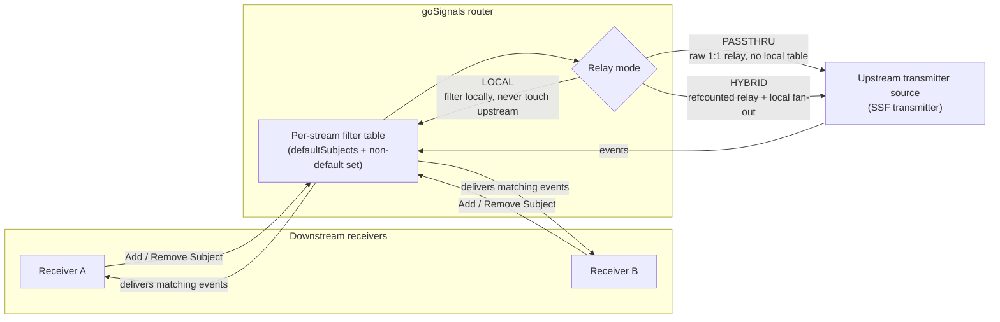
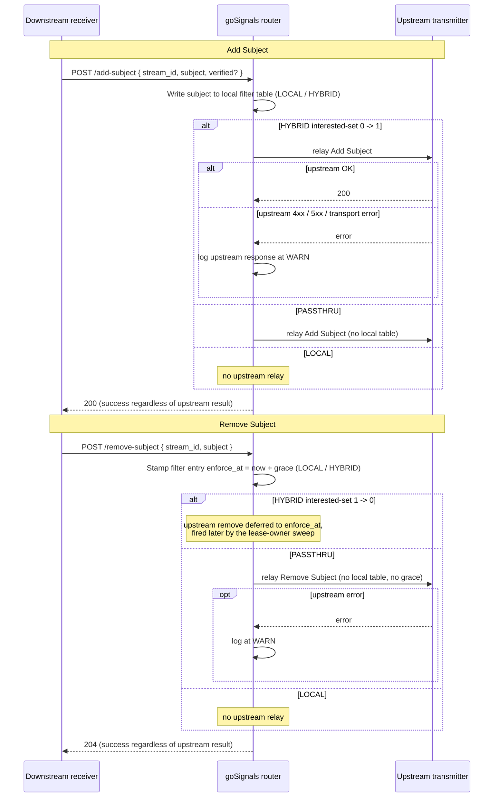

# SSF Subject Filtering in goSignals

goSignals can sit between SSF transmitters and receivers as a router. A
receiver often wants only a *subset* of the subjects an upstream transmitter
sends. The OpenID Shared Signals Framework §8.1.3 Add Subject / Remove Subject
endpoints are how a receiver expresses that, and **subject filtering** is the
goSignals layer that implements them: it tracks which subjects each stream
cares about and drops events for the rest at delivery time.

This document is written for two readers. The **operator section** below is
what you need to enable, configure, and inspect subject filtering. The
**implementation notes** further down are for developers and for anyone
debugging the internals — storage shape, the match-result cache, and the
deferred-relay sweep.

It is the implementation companion to:

- `CONTEXT.md` — the "Subject filtering vocabulary" section (the terms used
  here: subject, subject matching, `defaultSubjects`, subject filtering mode,
  subject handler, Add/Remove Subject).
- `docs/adr/0002-subject-filtering-at-delivery-time.md` — why filtering is
  applied at delivery time, not at routing time.
- `docs/adr/0003-split-subject-filter-storage.md` — the storage shape, the
  per-node match-result cache, and the sparse `enforce_at` index.
- `docs/security_model.md` — the SSF §9 security posture (§9.1 / §9.2 / §9.3).
- `docs/configuration_properties.md` — the environment variables referenced
  below.

---

# Operator section

## What subject filtering does for you

When subject filtering is on, goSignals:

- Accepts Add Subject / Remove Subject requests from downstream receivers.
- Keeps a per-stream **filter table** of the non-default subject set.
- Drops events a stream should not receive, at the moment its pending buffer
  is drained.
- Can relay Add/Remove **upstream** to the transmitter source when the relay
  mode says to (`PASSTHRU` or `HYBRID`).
- Defers a delivery-*stopping* change by a configurable grace period, so a
  compromised receiver cannot instantly blind a downstream (SSF §9.3,
  "Malicious Subject Removal").
- Exposes a read-only admin review endpoint so you can inspect a stream's
  filter state without touching the database.

Subject filtering is **disabled by default**. While disabled, the Add/Remove
Subject endpoints return 404, are absent from SSF discovery metadata, and the
§9.3 grace mechanism and admin review endpoint are inert.

## How a subject flows through a router

A receiver subscribes to a goSignals router; the router in turn pulls from an
upstream transmitter source. Each stream carries its own filter table, and the
**relay mode** decides whether an Add/Remove also travels upstream. The three
relay topologies:



- **`PASSTHRU`** — the router relays each Add/Remove straight to the upstream
  and keeps **no local filter table**. Downstream streams share one upstream
  subscription and share fate: one receiver's Remove removes the subject for
  everyone. The upstream's own §9.3 handling is authoritative.
- **`LOCAL`** — the router filters locally and **never touches the upstream**.
  Required when the upstream advertises no Add/Remove endpoints, or when
  events arrive by means other than an SSF stream (e.g. a direct POST).
- **`HYBRID`** — the router both reference-counts the upstream relay *and*
  fans out locally, so each downstream sees only the subjects it asked for.
  It relays an `add` upstream when the interested-set goes 0→1 and a `remove`
  only when it goes 1→0.

## Enabling and configuring

Two environment variables gate and tune the feature server-wide
(full reference in `docs/configuration_properties.md`):

| Variable                      | Default     | What it does                                                                                                  |
| ----------------------------- | ----------- | ------------------------------------------------------------------------------------------------------------- |
| `I2SIG_SUBJECT_FILTERING`     | `DISABLED`  | `ENABLED` advertises `add_subject_endpoint` / `remove_subject_endpoint` in SSF discovery, makes `defaultSubjects` settable, and registers `POST /subject-filter/review`. `DISABLED` hides the endpoints and returns 404. |
| `I2SIG_SUBJECT_REMOVAL_GRACE` | `0`         | Server-wide default for the SSF §9.3 grace window, in **seconds**. `0` means immediate enforcement. Per-stream override via the management API. Negative or non-integer values fall back to `0`. |

Disabling subject filtering after streams exist leaves the filter rows in the
database but stops consulting them — delivery reverts to "send everything that
routes here."

Beyond the server-wide gate, each stream carries four operator-tunable knobs.
These are the **config** view (what you set), distinct from the **status**
view (what the filter table is doing right now).

| Field                            | Side           | Effect                                                                  |
| -------------------------------- | -------------- | ----------------------------------------------------------------------- |
| `default_subjects`               | Transmitter    | `ALL` or `NONE` baseline delivery policy.                               |
| `subject_filter_mode`            | Receiver       | `PASSTHRU` / `LOCAL` / `HYBRID` relay strategy.                         |
| `event_source.type`              | Transmitter    | `DIRECT` / `AUDIENCE` / `EXPLICIT` — constrains relay-mode validity.    |
| `subject_removal_grace_seconds`  | Transmitter    | §9.3 grace override (seconds). `0` = immediate. Receiver-side: WARN.    |

### `defaultSubjects` — the baseline policy

A goSignals extension (*not* an SSF stream-config field). Two values:

- **`ALL`** — every subject that routes here is delivered by default; the
  filter table holds the subjects that have been *removed*.
- **`NONE`** — nothing is delivered by default; the filter table holds the
  subjects the receiver has explicitly *added*.

It is a *default*, not a guarantee. Per SSF, a transmitter MAY ignore
Add/Remove requests and MAY deliver subjects out-of-band on its own policy. So
a `NONE` upstream may still send subjects goSignals never added, and an `ALL`
upstream may withhold some. goSignals therefore applies the downstream filter
to **whatever arrives**, judged purely on that stream's own `defaultSubjects`
plus filter table — never on how or why the event arrived.

Changing `defaultSubjects` on a live stream is a deliberate reset: the filter
table is cleared, because old entries carry the opposite meaning under the new
baseline. The reset bypasses the §9.3 grace period — it is an operator action,
not the §9.3 threat.

### `subjectFilterMode` — the relay strategy

Set on a **receiver stream**; it picks one of the three topologies in the
diagram above. `PASSTHRU` and `HYBRID` further require the upstream to
advertise `add_subject_endpoint` / `remove_subject_endpoint`, and an
unambiguous **subject handler** — when several receiver streams share an
issuer, you MUST nominate the relay target at configuration time via an
Explicit (SID) event source. `HYBRID` is meaningful only against a
`defaultSubjects=NONE` upstream; against an `ALL` upstream everything already
arrives, so it behaves as pure local filtering.

The **event source** axis (`DIRECT` / `AUDIENCE` / `EXPLICIT`) constrains
which modes are valid; config validators reject inconsistent combinations at
stream-update time, not at runtime.

## Add Subject / Remove Subject

The standard SSF §8.1.3.2 / §8.1.3.3 endpoints, as goSignals implements them:

- **Add Subject** POST returns **200** regardless of whether the subject has
  ever been seen on the wire — the endpoint is a *statement of interest*, not
  a directory lookup. This is deliberate §9.1 posture: goSignals does not
  expose a probing oracle.
- **Remove Subject** POST returns **204**.
- Both carry `stream_id` and `subject`; Add also carries an optional
  `verified` flag, stored for audit and relayed upstream verbatim but with no
  effect on delivery — goSignals is not an identity verifier.
- A receiver token authorizes only its own stream. An admin-scoped caller may
  target any stream by supplying `stream_id`.
- Add/Remove take effect for **future events only** — there is no replay. A
  receiver that wants history uses `ResetDate` / `ResetJti` instead.

**Relay errors are tolerated.** When goSignals relays an Add or Remove
upstream on a `PASSTHRU` or `HYBRID` stream and the upstream returns 404, any
other 4xx, a 5xx, or a transport error, goSignals logs the upstream response
at `WARN` and **still returns success to the downstream receiver**. Surfacing
the upstream status verbatim would re-create the §9.1 oracle goSignals does
not expose for itself; the local filter write (for `HYBRID`) and the
receiver's expression of interest are authoritative — the upstream
subscription is best-effort.

The relay decision and the WARN-and-tolerate behaviour, end to end:



## SSF §9.3: the removal grace period

A configurable interval during which a subject whose delivery was just
*stopped* keeps being delivered, so a malicious or coerced receiver cannot
instantly blind a downstream by quietly removing a victim subject. The rules:

- **Gate the effect, not the verb.** Any operation that *stops* delivery for a
  subject — Add or Remove, `ALL` or `NONE` — is deferred by the grace period.
  Any operation that *starts or resumes* delivery takes effect immediately.
- **Re-Add cancels.** A re-Add during the grace window revives the entry and
  clears its deadline.
- **`LOCAL` and `HYBRID` only.** `PASSTHRU` adds no grace of its own — the
  upstream transmitter's §9.3 handling is authoritative.
- **A `defaultSubjects` flip bypasses grace.** A flip is a deliberate operator
  action, not the §9.3 receiver-initiated threat; it clears the filter table
  immediately.
- **Events delivered during the grace window are normal deliveries** (per SSF
  §9.3) — the receiver must not treat them as errors.

Configure it with the server-wide `I2SIG_SUBJECT_REMOVAL_GRACE` default, or a
per-transmitter-stream `subject_removal_grace_seconds` override set via the
management API (or the CLI, below). A grace value on a *receiver* stream is
ignored with a `WARN`.

## CLI tooling

`cmd/goSignals` exposes subject filtering on the standard `get` and `set`
verbs. The command group has the alias `sf`, so `get sf` / `set sf` also work.
Every command takes an optional `<alias>` positional that defaults to the
selected stream.

```text
goSignals> get subject-filter config <alias>
goSignals> get subject-filter status <alias> [<subject-json>] [field flags]

goSignals> set subject-filter config <alias>
                                  [--default-subjects ALL|NONE]
                                  [--mode PASSTHRU|LOCAL|HYBRID]
                                  [--event-source DIRECT|AUDIENCE|EXPLICIT]
                                  [--source-stream-ids <sid,sid,...>]
                                  [--grace-seconds <n>]
goSignals> set subject-filter add    <alias> [<subject-json>] [field flags] [--verified]
goSignals> set subject-filter remove <alias> [<subject-json>] [field flags]
```

### Reading: `get subject-filter`

- **`get subject-filter config`** prints the four operator-tunable knobs alone
  — `defaultSubjects`, mode, event source, removal grace — the policy view of
  "what is configured?".
- **`get subject-filter status`** prints the runtime filter-table view: the
  aggregate `counts` and the pending-removal list. Supply a subject (either as
  a positional JSON literal or via the format field flags, below) to also get
  a point-lookup result — found, kind, pending, delivers, enforce-at. A
  `PASSTHRU` stream keeps no local table; that is reported plainly, not as an
  error. The CLI never dumps the full filter table — the server endpoint is
  point-lookup + counts by design (ADR-0003).

### Writing: `set subject-filter`

- **`set subject-filter config`** writes the four knobs through the existing
  PRD #89 stream-update path — no new server endpoint. Each knob is
  individually optional; omitted knobs mean "do not change". `--source-stream-ids`
  accepts raw stream SIDs (comma-separated or repeated) for an `EXPLICIT`
  event source; the CLI rejects it combined with a non-`EXPLICIT` source and
  rejects `--event-source EXPLICIT` without it. After the update the command
  re-reads the persisted settings, so the display surfaces the server's
  WARN-and-ignore behaviour for a grace override set on a receiver stream (the
  value comes back as `0`).
- **`set subject-filter add`** performs an administrative SSF Add Subject
  (`POST /add-subject`) with the operator's admin token. `--verified` sets the
  SSF Add Subject `verified` flag and is omitted by default.
- **`set subject-filter remove`** performs an administrative SSF Remove
  Subject (`POST /remove-subject`). There is no `--verified` flag — `verified`
  is meaningful for Add only.

`set subject-filter add` / `remove` are the administrative add/remove verbs:
they reuse the SSF Add/Remove Subject endpoints, which already accept the
admin scope, so an operator can mutate any stream's filter by alias without a
receiver token.

### Supplying a subject

`get subject-filter status` and the `set subject-filter add` / `remove`
commands take a subject either as a positional `<subject-json>` SubjectIdentifier
JSON literal **or** via format field flags — the two are mutually exclusive.
Each field flag pins the subject format; there is deliberately no `--format`
flag:

| Flag                  | Format         |
| --------------------- | -------------- |
| `--email`             | `email`        |
| `--phone-number`      | `phone_number` |
| `--iss` + `--sub`     | `iss_sub`      |
| `--id`                | `opaque`       |
| `--url`               | `did`          |
| `--username`          | `username`     |
| `--external-id`       | `externalId`   |
| `--account`           | `account`      |
| `--uri`               | `uri`          |

Complex subjects, the `aliases` array, the `scim` format, and any
unrecognised format are supplied as positional JSON. Because the positionals
fill left-to-right, `<alias>` must be given explicitly whenever a positional
`<subject-json>` is supplied.

> **Naming note.** The server endpoint behind the status/config views is
> `POST /subject-filter/review`, but the CLI no longer uses the word "review"
> — `get subject-filter status|config` replaced it. This wire-vs-CLI
> divergence is deliberate and accepted.

## SSF §9 security posture

goSignals' full §9 posture is in `docs/security_model.md` ("SSF §9 Subject
Filtering Security Posture"). The short version:

- **§9.1 Subject Probing.** goSignals keeps no subject directory and never
  returns 404 for "subject unknown" — its only 404 is feature-disabled. Add
  Subject is a statement of interest, not a lookup. Upstream relay errors are
  absorbed and not surfaced downstream, so an upstream's §9.1 oracle is not
  transitively exposed.
- **§9.2 Information Harvesting.** Not solved (it is a property of the
  receiver's authorization model), but the blast radius is contained: a
  receiver token is scoped to a single stream; subject filtering is opt-in
  server-wide; the review endpoint requires the admin scope, distinct from the
  per-stream receiver scope.
- **§9.3 Malicious Subject Removal.** Addressed by the removal grace period.

---

# Implementation notes

This section is for developers and for anyone debugging the internals. The
operator section above is self-sufficient for running goSignals; nothing below
changes how you configure it.

## When the filter is applied

The filter is consulted at **delivery time**, not at routing time. The
decision is `Allows(stream, event) → deliver | drop`. See
`docs/adr/0002-subject-filtering-at-delivery-time.md` for the rationale; the
short version is that routing runs on whichever node ingests an event, so a
routing-time filter would force every node to hold every stream's filter with
no existing cluster channel to keep them consistent.

- **PUSH** — in `runPushLoop` on the node holding the `push-transmitter:<sid>`
  lease. A filtered-out JTI is **discarded (acked), not pushed** — the pending
  list still drains and stays bounded. The filter is read from Mongo through a
  per-node match-result cache; Add/Remove on any node triggers a cluster
  wake-up to the lease owner so the cache stays correct.
- **POLL** — at poll-response time on whichever node serves the poll. The
  filter is read straight from Mongo (polls are cold and batched).
- **Operational events** (`Operational=true` — `verify`, `stream-updated`)
  carry no subject and always pass the filter.

## Storage shape

A subject filter may legitimately reach **millions of entries** (a watchlist
of every account or email a receiver cares about), so the storage is split by
subject kind. See `docs/adr/0003-split-subject-filter-storage.md`; the
highlights:

- **Simple subjects** (the §8.1.3.1 "exactly identical" match) canonicalize
  per RFC9493 per-format rules to one stable key and live in a hash-indexed
  set: O(1) membership.
- **Complex subjects** (field-wise with undefined-as-wildcard) cannot collapse
  to a single key, so they sit in a small linear-scanned list. Complex
  subjects are the rare device/session composites; the list stays short.
- A per-node, bounded-size, short-TTL **match-result cache** absorbs the hot
  re-lookups when many events arrive about the same subject in a short window.
  PUSH and POLL both go through it.
- A **sparse partial index on `enforce_at`** (the §9.3 grace timestamp) makes
  pending removals enumerable for the admin review endpoint and the
  push-transmitter sweep without scanning the whole table. Only entries
  currently inside their grace window carry the field.

Cache accuracy is deliberately soft. A stale **"deliver"** merely
over-delivers for a few seconds — harmless, and consistent with §9.3's
tolerance for events delivered after a removal. A stale **"drop"** is the
hazardous direction, so cluster invalidation fires promptly on
delivery-*increasing* operations (Add). Delivery-*decreasing* operations are
already softened by the §9.3 grace period.

Both the Mongo and in-memory DAOs implement the storage shape mechanically the
same way (`internal/dao/mongo/subject_filter_dao.go`,
`internal/dao/memory/subject_filter_dao.go`).

## §9.3 grace as a timestamp, not a scheduler

Stopping delivery stamps the entry with `enforce_at = now + grace`. The
delivery-time filter treats a pending-removal entry as **still active until
`now ≥ enforce_at`**. Pure lazy comparison: restart-safe, cluster-safe, no
scheduled job. The entry lifecycle is upsert / stamp / lazy-purge — never a
mid-grace hard delete, so a re-Add can revive it.

### HYBRID deferred upstream `remove`

When a `HYBRID` interested-set goes 1→0, goSignals does **not** relay the
upstream `remove` immediately. The deferral is to the same `enforce_at`, so
the upstream keeps feeding events through the grace window and §9.3 is honored
consistently with `LOCAL`. The deferred relay fires from a sweep on the
**`push-transmitter:<sid>` lease owner**, reusing the existing
recovery/backfill ticker (`internal/eventRouter/event_router.go`
`sweepDeferredHybridRelays`) — no new scheduler is introduced. A re-Add (set
0→1) before `enforce_at` cancels the pending upstream `remove`.

### Config validation

The `subject_removal_grace_seconds` override is validated alongside the other
PRD #89 mode / event-source rules at stream-update time
(`validateSubjectRemovalGrace`, `applyRemovalGraceOverride` in
`internal/services/stream_service.go`), so a misconfiguration is caught before
it can change runtime behaviour.

## Admin review endpoint

`POST /subject-filter/review` (PRD #97 issue #101) — a read-only view of a
stream's locally managed subject filter, and the wire endpoint behind the
`get subject-filter config|status` CLI commands. Authorized with the goSignals
admin scope (`ScopeStreamAdmin`, `ScopeStreamMgmt`, or `ScopeRoot`) — distinct
from the per-stream receiver scope used by the SSF Add/Remove endpoints. A
receiver-scoped token is rejected.

**Request body:**

```json
{
  "stream_id": "...",
  "subject": { "format": "email", "email": "alice@example.com" }
}
```

`stream_id` is required. `subject` is optional; supplying it adds a
point-lookup result to the response. The endpoint is deliberately not
paginated and does not enumerate the filter table — the hash index makes "is
subject X filtered here?" O(1), and millions of rows are never streamed to an
operator (ADR-0003).

**Response body:**

```json
{
  "stream_id": "...",
  "mode": "LOCAL|HYBRID|PASSTHRU",
  "default_subjects": "ALL|NONE",
  "event_source": { "type": "AUDIENCE|EXPLICIT|DIRECT", ... },
  "subject_removal_grace_seconds": 0,
  "passthru_no_local_filter": false,
  "counts": { "total": 0, "pending": 0 },
  "pending": [
    { "subject": { ... }, "canonical_key": "...", "kind": "email", "enforce_at": "..." }
  ],
  "lookup": {
    "subject": { ... },
    "found": true,
    "kind": "email",
    "canonical_key": "...",
    "enforce_at": "...",
    "pending": false,
    "delivers": true
  }
}
```

A `PASSTHRU` stream returns `passthru_no_local_filter=true` and omits
`counts` / `pending` — there is no local filter table to summarize. That
behaviour is explicit, not an error.

**Status codes:**

| Status | Meaning                                                               |
| ------ | --------------------------------------------------------------------- |
| 200    | Review returned.                                                      |
| 400    | Malformed body or missing `stream_id`.                                |
| 401    | Unauthenticated.                                                      |
| 403    | A stream-bound token names a different stream than `stream_id`.       |
| 404    | Subject filtering disabled server-wide, or the stream does not exist. |
| 500    | DAO error.                                                            |

## Key files

- `internal/services/subject_filter_service.go` — Add/Remove, RelayDecision,
  grace plumbing, deferred-relay sweep entry point.
- `internal/services/subject_grace.go` — pure §9.3 timestamp logic (the
  cheapest test surface).
- `internal/services/subject_filter_review.go` — review request handling
  (point lookup, counts, pending list).
- `internal/services/subject_filtering.go` — env-var parsing and the
  `SubjectFilteringEnabled()` gate.
- `internal/services/stream_service.go` — config validation
  (`validateSubjectRemovalGrace`, `applyRemovalGraceOverride`).
- `internal/server/api_subject_filter_review.go` — the admin endpoint.
- `internal/server/api_stream_management.go` — Add/Remove handler with
  WARN-and-tolerate on upstream relay errors.
- `internal/eventRouter/event_router.go` — `sweepDeferredHybridRelays`,
  called from the existing push-transmitter backfill ticker.
- `internal/dao/{mongo,memory}/subject_filter_dao.go` — storage adapters with
  the sparse `enforce_at` partial index.
- `cmd/goSignals/commands.go` — `GetSubjectFilterCmd` (`config`, `status`),
  `SetSubjectFilterCmd` (`config`, `add`, `remove`).
- `cmd/goSignals/subject_arg.go` — the shared subject-input parser for the
  positional JSON literal and the format field flags.
