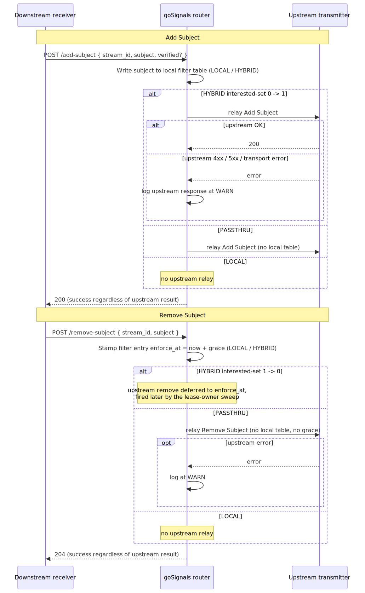

<!-- gosignals-brand-hero -->
<picture><source media="(prefers-color-scheme: dark)" srcset="../brand/logo/gosignals-hero-primary.svg"></picture>

# SSF Subject Filtering — Operator Runbook

goSignals can sit between SSF transmitters and receivers as a router. A
receiver often wants only a *subset* of the subjects an upstream transmitter
sends; the OpenID Shared Signals Framework §8.1.3 Add Subject / Remove
Subject endpoints are how it expresses that. **Subject filtering** is the
goSignals layer that implements the receiver's request: per-stream
bookkeeping of which subjects matter, and dropping the rest at delivery time.

This document is the operator runbook — what to enable, what to configure,
what to inspect. Design rationale lives elsewhere:

- `CONTEXT.md` — the subject-filtering vocabulary (subject, subject matching,
  `defaultSubjects`, subject filtering mode, subject handler, Add/Remove
  Subject).
- `docs/adr/0002-subject-filtering-at-delivery-time.md` — why filtering is
  applied at delivery time.
- `docs/adr/0003-split-subject-filter-storage.md` — storage shape, match
  cache, sparse `enforce_at` index.
- `docs/adr/0004-event-source-type.md` — `event_source.type` semantics and
  validation rules.
- `docs/security_model.md` — the SSF §9 security posture.
- `docs/configuration_properties.md` — full env-var reference.

## What subject filtering does for you

When subject filtering is on, goSignals:

- Accepts Add Subject / Remove Subject requests from downstream receivers.
- Keeps a per-stream **filter table** of the non-default subject set.
- Drops events a stream should not receive, at the moment its pending buffer
  is drained.
- Can relay Add/Remove **upstream** to the transmitter source when the relay
  mode says to (`PASSTHRU` or `HYBRID`).
- Defers a delivery-*stopping* change by a configurable grace period, so a
  compromised receiver cannot instantly blind a downstream
  (SSF §9.3 "Malicious Subject Removal").
- Exposes a read-only admin review endpoint so you can inspect a stream's
  filter state without touching the database.

Subject filtering is **disabled by default**. While disabled, the Add/Remove
Subject endpoints return 404, are absent from SSF discovery metadata, and the
§9.3 grace mechanism and admin review endpoint are inert.

## How a subject flows through a router



A receiver subscribes to a goSignals router; the router in turn pulls from an
upstream transmitter source. Each stream carries its own filter table, and
the **relay mode** decides whether an Add/Remove also travels upstream.

- **`PASSTHRU`** — the router relays each Add/Remove straight to the upstream
  and keeps no local filter table. Downstream streams share one upstream
  subscription and share fate.
- **`LOCAL`** — the router filters locally and never touches the upstream.
  Required when the upstream advertises no Add/Remove endpoints, or when
  events arrive by means other than an SSF stream.
- **`HYBRID`** — the router reference-counts the upstream relay *and* fans
  out locally, so each downstream sees only the subjects it asked for. It
  relays an `add` upstream when the interested-set goes 0→1 and a `remove`
  only when it goes 1→0.

## Enabling and configuring

Two environment variables gate and tune the feature server-wide
(full reference in `docs/configuration_properties.md`):

| Variable                      | Default     | What it does                                                                                                  |
| ----------------------------- | ----------- | ------------------------------------------------------------------------------------------------------------- |
| `I2SIG_SUBJECT_FILTERING`     | `DISABLED`  | `ENABLED` advertises `add_subject_endpoint` / `remove_subject_endpoint` in SSF discovery, makes `defaultSubjects` settable, and registers `POST /subject-filter/review`. `DISABLED` hides the endpoints and returns 404. |
| `I2SIG_SUBJECT_REMOVAL_GRACE` | `0`         | Server-wide default for the SSF §9.3 grace window, in **seconds**. `0` means immediate enforcement. Per-stream override via the management API. Negative or non-integer values fall back to `0`. |

Disabling subject filtering after streams exist leaves the filter rows in
the database but stops consulting them — delivery reverts to "send
everything that routes here."

Each stream then carries four operator-tunable knobs:

| Field                            | Side           | Effect                                                                  |
| -------------------------------- | -------------- | ----------------------------------------------------------------------- |
| `default_subjects`               | Transmitter    | `ALL` or `NONE` baseline delivery policy.                               |
| `subject_filter_mode`            | Receiver       | `PASSTHRU` / `LOCAL` / `HYBRID` relay strategy.                         |
| `event_source.type`              | Transmitter    | `DIRECT` / `AUDIENCE` / `EXPLICIT` — see below.                         |
| `subject_removal_grace_seconds`  | Transmitter    | §9.3 grace override (seconds). `0` = immediate. Receiver-side: WARN.    |

### `defaultSubjects`

A goSignals extension (not an SSF stream-config field):

- **`ALL`** — every subject that routes here is delivered by default; the
  filter table holds the subjects that have been *removed*.
- **`NONE`** — nothing is delivered by default; the filter table holds the
  subjects the receiver has explicitly *added*.

It is a *default*, not a guarantee — goSignals applies the filter to
**whatever arrives**, judged purely on that stream's own `defaultSubjects`
plus filter table.

Changing `defaultSubjects` on a live stream is a deliberate reset: the
filter table is cleared, because old entries carry the opposite meaning
under the new baseline. The reset bypasses the §9.3 grace period.

### `subject_filter_mode`

Set on a **receiver stream**; picks one of the three topologies in the
diagram. `PASSTHRU` and `HYBRID` further require the upstream to advertise
`add_subject_endpoint` / `remove_subject_endpoint`, and an unambiguous
**subject handler** — see `event_source.type` below.

`HYBRID` is meaningful only against a `defaultSubjects=NONE` upstream;
against an `ALL` upstream everything already arrives, so it behaves as pure
local filtering.

### `event_source.type`

Set on a **transmitter stream** — declares where the stream's events come
from. Three values, each with a validation rule the server enforces at
stream-create / stream-update time (see ADR 0004):

| Value      | Meaning                                                                  | Validation rule                                                                |
| ---------- | ------------------------------------------------------------------------ | ------------------------------------------------------------------------------ |
| `DIRECT`   | Events arrive in Mongo by means other than an SSF stream (another service writes the pending list, or events are POSTed directly). No upstream to relay subject filter changes to. | `subject_filter_mode` must be `LOCAL`. `PASSTHRU` / `HYBRID` are rejected.     |
| `AUDIENCE` | Events are routed in by `iss`/`aud`/event-type matching from a receiver stream (the default). | The receiver stream feeding this transmitter must be unambiguous by `iss`. If multiple receivers share the issuer, the configuration is rejected — disambiguate with `EXPLICIT`. |
| `EXPLICIT` | The operator names the source stream SID(s) in `source_stream_ids`. The first SID is the relay target.  | `source_stream_ids` must be non-empty. Conversely, `source_stream_ids` is rejected with any other Type. |

**Unset Type defaults to `AUDIENCE`** silently — pre-existing streams keep
working without operator action.

`event_source` set on a **receiver** stream is dropped at create/update
time with a WARN — `event_source` describes a transmitter's input side and
has no meaning on the receiver side. Same precedent as
`subject_removal_grace_seconds` on a receiver.

## Add Subject / Remove Subject

The standard SSF §8.1.3.2 / §8.1.3.3 endpoints, as goSignals implements
them:

- **Add Subject** POST returns **200** regardless of whether the subject
  has ever been seen on the wire — the endpoint is a *statement of
  interest*, not a directory lookup (§9.1: no probing oracle).
- **Remove Subject** POST returns **204**.
- Both carry `stream_id` and `subject`; Add also carries an optional
  `verified` flag, stored for audit and relayed upstream verbatim but with
  no effect on delivery — goSignals is not an identity verifier.
- A receiver token authorizes only its own stream. An admin-scoped caller
  may target any stream by supplying `stream_id`.
- Add/Remove take effect for **future events only** — there is no replay.
  A receiver that wants history uses `ResetDate` / `ResetJti` instead.

**Relay errors are tolerated.** When goSignals relays an Add or Remove
upstream on a `PASSTHRU` or `HYBRID` stream and the upstream returns 404,
any other 4xx, a 5xx, or a transport error, goSignals logs at WARN and
**still returns success to the downstream receiver**. The local filter
write (for `HYBRID`) and the receiver's expression of interest are
authoritative; the upstream subscription is best-effort.

The full relay decision flow with the WARN-and-tolerate behavior, end to
end:



## SSF §9.3: the removal grace period

A configurable interval during which a subject whose delivery was just
*stopped* keeps being delivered, so a malicious or coerced receiver cannot
instantly blind a downstream by quietly removing a victim subject. The
rules:

- **Gate the effect, not the verb.** Any operation that *stops* delivery
  for a subject — Add or Remove, `ALL` or `NONE` — is deferred by the
  grace period. Any operation that *starts or resumes* delivery takes
  effect immediately.
- **Re-Add cancels.** A re-Add during the grace window revives the entry
  and clears its deadline.
- **`LOCAL` and `HYBRID` only.** `PASSTHRU` adds no grace of its own — the
  upstream transmitter's §9.3 handling is authoritative.
- **A `defaultSubjects` flip bypasses grace.** A flip is a deliberate
  operator action, not the §9.3 receiver-initiated threat.
- **Events delivered during the grace window are normal deliveries** (per
  SSF §9.3) — the receiver must not treat them as errors.

Configure with the server-wide `I2SIG_SUBJECT_REMOVAL_GRACE` default, or a
per-transmitter-stream `subject_removal_grace_seconds` override via the
management API (or the CLI). A grace value on a *receiver* stream is
ignored with a WARN.

Full §9 posture (probing, harvesting, malicious removal) is in
`docs/security_model.md`.

## CLI tooling

`cmd/goSignals` exposes subject filtering on the standard `get` and `set`
verbs. The command group has the alias `sf`, so `get sf` / `set sf` also
work. Every command takes an optional `<alias>` positional that defaults
to the selected stream.

```text
goSignals> get subject-filter config <alias>
goSignals> get subject-filter status <alias> [<subject-json>] [field flags]

goSignals> set subject-filter config <alias>
                                  [--default-subjects ALL|NONE]
                                  [--mode PASSTHRU|LOCAL|HYBRID]
                                  [--event-source DIRECT|AUDIENCE|EXPLICIT]
                                  [--source-stream-ids <sid,sid,...>]
                                  [--grace-seconds <n>]
goSignals> set subject-filter add    <alias> [<subject-json>] [field flags] [--verified]
goSignals> set subject-filter remove <alias> [<subject-json>] [field flags]
```

### Reading: `get subject-filter`

- **`get subject-filter config`** prints the four operator-tunable knobs
  — `defaultSubjects`, mode, event source, removal grace — the policy view
  of "what is configured?".
- **`get subject-filter status`** prints the runtime filter-table view:
  the aggregate `counts` and the pending-removal list. Supply a subject
  (positional JSON or field flags, below) to also get a point-lookup
  result — found, kind, pending, delivers, enforce-at. A `PASSTHRU` stream
  keeps no local table; that is reported plainly, not as an error.

### Writing: `set subject-filter`

- **`set subject-filter config`** writes the four knobs through the
  existing stream-update path. Each knob is individually optional;
  omitted knobs mean "do not change". `--source-stream-ids` accepts raw
  stream SIDs (comma-separated or repeated) for an `EXPLICIT` event
  source; the CLI rejects it combined with a non-`EXPLICIT` source and
  rejects `--event-source EXPLICIT` without it. After the update the
  command re-reads the persisted settings, so a grace override set on a
  receiver stream (silently dropped server-side) is visible as `0`.
- **`set subject-filter add`** performs an administrative SSF Add Subject
  (`POST /add-subject`) with the operator's admin token. `--verified`
  sets the SSF Add Subject `verified` flag and is omitted by default.
- **`set subject-filter remove`** performs an administrative SSF Remove
  Subject (`POST /remove-subject`). There is no `--verified` flag.

### Supplying a subject

`get subject-filter status` and the `set subject-filter add` / `remove`
commands take a subject either as a positional `<subject-json>`
SubjectIdentifier JSON literal **or** via format field flags — the two
are mutually exclusive. Each field flag pins the subject format:

| Flag                  | Format         |
| --------------------- | -------------- |
| `--email`             | `email`        |
| `--phone-number`      | `phone_number` |
| `--iss` + `--sub`     | `iss_sub`      |
| `--id`                | `opaque`       |
| `--url`               | `did`          |
| `--username`          | `username`     |
| `--external-id`       | `externalId`   |
| `--account`           | `account`      |
| `--uri`               | `uri`          |

Complex subjects, the `aliases` array, the `scim` format, and any
unrecognised format are supplied as positional JSON. Because the
positionals fill left-to-right, `<alias>` must be given explicitly
whenever a positional `<subject-json>` is supplied.

> **Naming note.** The server endpoint behind the status/config views is
> `POST /subject-filter/review`, but the CLI no longer uses the word
> "review" — `get subject-filter status|config` replaced it.

## Admin review endpoint

`POST /subject-filter/review` — a read-only view of a stream's locally
managed subject filter, and the wire endpoint behind the
`get subject-filter config|status` CLI commands. Authorized with the
goSignals admin scope (`ScopeStreamAdmin`, `ScopeStreamMgmt`, or
`ScopeRoot`) — distinct from the per-stream receiver scope used by the
SSF Add/Remove endpoints. A receiver-scoped token is rejected.

**Request body:**

```json
{
  "stream_id": "...",
  "subject": { "format": "email", "email": "alice@example.com" }
}
```

`stream_id` is required. `subject` is optional; supplying it adds a
point-lookup result to the response. The endpoint is deliberately not
paginated and does not enumerate the filter table — the hash index makes
"is subject X filtered here?" O(1), and millions of rows are never
streamed to an operator (see ADR 0003).

**Response body:**

```json
{
  "stream_id": "...",
  "mode": "LOCAL|HYBRID|PASSTHRU",
  "default_subjects": "ALL|NONE",
  "event_source": { "type": "AUDIENCE|EXPLICIT|DIRECT", ... },
  "subject_removal_grace_seconds": 0,
  "passthru_no_local_filter": false,
  "counts": { "total": 0, "pending": 0 },
  "pending": [
    { "subject": { ... }, "canonical_key": "...", "kind": "email", "enforce_at": "..." }
  ],
  "lookup": {
    "subject": { ... },
    "found": true,
    "kind": "email",
    "canonical_key": "...",
    "enforce_at": "...",
    "pending": false,
    "delivers": true
  }
}
```

A `PASSTHRU` stream returns `passthru_no_local_filter=true` and omits
`counts` / `pending` — there is no local filter table to summarize.

**Status codes:**

| Status | Meaning                                                               |
| ------ | --------------------------------------------------------------------- |
| 200    | Review returned.                                                      |
| 400    | Malformed body or missing `stream_id`.                                |
| 401    | Unauthenticated.                                                      |
| 403    | A stream-bound token names a different stream than `stream_id`.       |
| 404    | Subject filtering disabled server-wide, or the stream does not exist. |
| 500    | DAO error.                                                            |

---

<!-- gosignals-brand-footer -->
<p align="center"><sub>(C)2026 Independent Identity Inc.</sub></p>
